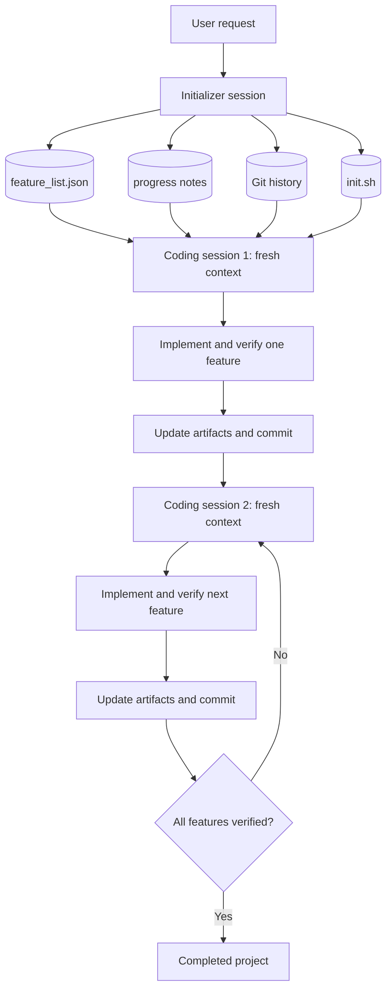

# Reading Note: Effective Harnesses for Long-Running Agents

[English](effective-harnesses-for-long-running-agents.md) | [简体中文](effective-harnesses-for-long-running-agents.zh-CN.md)

- Published: November 26, 2025
- Article: [Effective harnesses for long-running agents](https://www.anthropic.com/engineering/effective-harnesses-for-long-running-agents)
- Organization: based on the author's personal Notion reading notes

## 1. Problem

Developers increasingly expect agents to work for hours or days. A bare agent has difficulty making
consistent progress because a task can exceed one context window, while a new model invocation or
fresh coding session does not automatically know what happened before.

Simply replaying all prior interaction is not a scalable solution:

- The history eventually exceeds the context limit.
- Old plans, failed attempts, and verbose tool outputs create noise.
- The agent may lose important constraints or repeat completed work.
- As the context fills, the model may prematurely wrap up instead of continuing the task.

A harness addresses this by externalizing persistent state, selecting relevant context, coordinating
tools, validating progress, and supporting retries and recovery.

## 2. Why Compaction Alone Is Insufficient

Compaction summarizes older conversation history to free context space. It improves capacity, but a
summary may omit implementation details, open problems, or the exact next action. Two failure modes
still appeared:

1. **One-shot behavior:** the agent attempts too much at once, reaches the context boundary halfway
   through a feature, and leaves ambiguous partial work.
2. **Premature completion:** a later agent sees substantial progress and declares the entire project
   complete even though important features remain unfinished.

The problem therefore has two parts:

- Establish a complete, inspectable definition of the target state.
- Require each session to make bounded progress and leave a clean, explicit handoff.

## 3. Two-Agent Harness

The proposed harness separates initialization from incremental implementation.

### Initializer Agent

The first session prepares the environment for all later sessions:

- Expands the request into a comprehensive feature list.
- Marks every feature as failing until it is verified.
- Creates a progress log.
- Creates a reproducible startup script.
- Initializes Git and records the starting state.

### Coding Agent

Each later session:

1. Reconstructs the current state from durable artifacts.
2. Starts the application and runs a basic end-to-end check.
3. Chooses one high-priority unfinished feature.
4. Implements and tests that feature.
5. Marks it complete only after verification.
6. Updates the handoff notes and commits a clean working state.

## 4. Context Reset + Structured Handoff

The central mechanism can be summarized as:

> Reset conversational context while preserving structured project state.

### Context Reset

The next coding session starts with a fresh context instead of inheriting the full conversation.
This can:

- Prevent unbounded context growth
- Remove irrelevant logs and failed reasoning paths
- Reduce interference from stale assumptions
- Keep one session focused on one feature
- Reduce premature wrap-up behavior near the context boundary

### Structured Handoff

Continuity comes from external artifacts rather than hidden conversational memory:

| Artifact | Responsibility |
| --- | --- |
| `feature_list.json` | Complete requirements, acceptance steps, and verified status |
| Progress notes | Completed work, test results, known problems, and recommended next action |
| Git history | Auditable checkpoints, diffs, and recovery points |
| `init.sh` | One reproducible way to start the environment |
| Code and tests | The current executable source of truth |

JSON is useful for completion state because its schema can be validated and constrained. Narrative
progress notes are useful for explanation, but should not replace executable tests or structured
status.

## 5. Session Protocol

### Start of Session

- Confirm the working directory.
- Read the feature list, progress notes, and recent Git history.
- Read the startup procedure.
- Start the application.
- Run a smoke test before making changes.
- Fix an existing broken state before adding a new feature.

### During the Session

- Work on one bounded feature.
- Preserve unrelated behavior.
- Use environmental evidence rather than self-assessment alone.
- Keep changes small enough to complete, test, and document before the context ends.

### End of Session

- Run the required tests, including end-to-end checks where applicable.
- Update only statuses supported by evidence.
- Record remaining problems and the recommended next action.
- Commit a coherent, working checkpoint.
- Leave the repository ready for another agent to continue immediately.

## 6. What “Clean State” Means

A clean handoff is stronger than “some code was written.” It means:

- The repository builds or starts through the documented command.
- Existing verified behavior still works.
- The selected feature is either fully completed or explicitly left incomplete.
- No silent partial implementation is presented as finished.
- Tests, progress notes, feature status, and Git history agree.
- A new session does not need to reverse-engineer what the previous session attempted.

## 7. Testing as Ground Truth

Agents may mark work complete after shallow checks. The harness should provide tools that observe the
same system a user would observe. For a web application, this means testing the running interface,
not only checking source code or calling one API endpoint.

The verifier can include:

- Unit and integration tests
- Browser automation
- API and database-state checks
- Static analysis and type checking
- Explicit feature acceptance steps

Passing one narrow test is not proof that the whole feature works. The feature list should describe
observable behavior and its end-to-end acceptance conditions.

## 8. Important Terminology

This article sometimes describes each fresh coding run as a new “session.” Later agent
infrastructure uses **session** more precisely for the durable logical run or event log. The invariant
for this project is:

> Session != context window.

A long-lived logical session can span several fresh context windows. Resetting model context should
not delete the durable feature state, Git history, files, budgets, or outcomes.

## 9. Limits and Open Questions

- How much detail must a handoff preserve without becoming another oversized context?
- Should one general coding agent continue across sessions, or should testing, cleanup, and QA use
  specialized agents?
- How do we detect an incomplete or misleading progress artifact?
- How do we recover safely if the process fails between a tool side effect and event persistence?
- Does each added harness component improve verified outcomes enough to justify its cost?

## 10. Main Takeaway

Long-running reliability does not come from asking a model to “keep working.” It comes from a
protocol that limits the scope of each session, persists inspectable state, verifies real behavior,
and leaves a clean recovery point for the next context.

