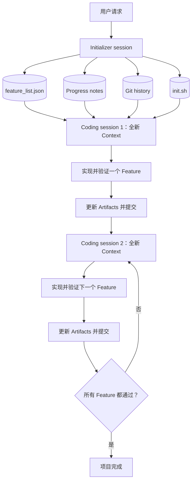

# 阅读笔记：Effective Harnesses for Long-Running Agents

[English](effective-harnesses-for-long-running-agents.md) | [简体中文](effective-harnesses-for-long-running-agents.zh-CN.md)

- 发布时间：2025 年 11 月 26 日
- 原文：[Effective harnesses for long-running agents](https://www.anthropic.com/engineering/effective-harnesses-for-long-running-agents)
- 组织方式：根据作者的个人 Notion 阅读记录整理

## 1. 问题是什么？

开发者希望 Agent 能够持续工作数小时甚至数天，但裸 Agent 很难稳定推进长任务：一个复杂项目
可能超过单个 context window，而新的模型调用或新的 coding session 不会自动知道此前发生了什么。

把全部历史重新放回上下文也无法长期扩展：

- 历史最终会超过 context limit。
- 旧计划、失败尝试和冗长 tool output 会形成噪声。
- Agent 可能忘记重要约束，或重复已经完成的工作。
- Context 接近上限时，模型可能过早收尾，而不是继续完成任务。

Harness 通过外部化持久状态、选择相关上下文、协调工具、验证进度以及支持重试和恢复来解决这些
问题。

## 2. 为什么只有 Compaction 还不够？

Compaction 通过总结较早的对话释放上下文空间。它改善了容量问题，但 summary 可能遗漏实现细节、
未解决问题或准确的下一步动作。实验中仍然存在两类主要失败：

1. **One-shot 倾向：** Agent 一次尝试完成过多工作，在 feature 尚未完成时耗尽 context，留下
   难以理解的半成品。
2. **过早宣布完成：** 后续 Agent 看到项目已有较多代码，就认为整个任务已经完成，忽略剩余功能。

因此问题需要被拆成两部分：

- 建立完整、可检查的目标状态定义。
- 要求每个 session 只推进有限工作，并留下干净、明确的 handoff。

## 3. 双 Agent Harness

该 Harness 将环境初始化与增量实现分开。

### Initializer Agent

第一个 session 为后续工作建立基础：

- 将用户请求扩展成完整 feature list。
- 所有 feature 在被验证前都标记为 failing。
- 创建 progress log。
- 创建可重复执行的启动脚本。
- 初始化 Git 并记录项目起点。

### Coding Agent

后续每个 session 都执行以下协议：

1. 从持久化 artifacts 恢复当前状态。
2. 启动应用并运行基础端到端检查。
3. 选择一个高优先级且尚未完成的 feature。
4. 实现并测试该 feature。
5. 只有验证通过后才修改完成状态。
6. 更新交接笔记，并提交一个干净、可工作的状态。

## 4. Context Reset + Structured Handoff

核心机制可以概括为：

> 重置对话上下文，同时保留结构化项目状态。

### Context Reset

下一轮 Coding Agent 不继承此前完整对话，而是从新的 context 开始。这样可以：

- 避免上下文无限膨胀。
- 去除无关日志和失败的推理路径。
- 减少过期假设对当前工作的干扰。
- 让一个 session 专注于一个 feature。
- 缓解模型接近 context limit 时过早收尾的问题。

### Structured Handoff

连续性来自外部 artifacts，而不是不可见的对话记忆：

| Artifact | 职责 |
| --- | --- |
| `feature_list.json` | 完整需求、验收步骤和验证状态 |
| Progress notes | 已完成工作、测试结果、已知问题和建议的下一步 |
| Git history | 可审计 checkpoint、diff 和恢复点 |
| `init.sh` | 唯一且可复现的环境启动方式 |
| 代码和测试 | 项目当前状态的可执行事实来源 |

JSON 适合保存完成状态，因为 schema 可以被校验和约束。叙述性 progress notes 适合解释，但不能
替代可执行测试或结构化状态。

## 5. Session 协议

### Session 开始时

- 确认工作目录。
- 阅读 feature list、progress notes 和最近的 Git history。
- 阅读启动方式并启动应用。
- 修改代码前先执行 smoke test。
- 如果已有功能损坏，先恢复正常状态，再添加新功能。

### Session 执行期间

- 一次只处理一个边界清晰的 feature。
- 保持无关功能不被破坏。
- 使用环境证据，不只依赖模型自我评价。
- 控制改动规模，保证在 context 结束前完成、测试和记录。

### Session 结束时

- 执行必要测试；适用时包含端到端验证。
- 只有存在证据时才更新 feature 状态。
- 记录剩余问题和建议的下一步。
- 提交一个连贯、可工作的 checkpoint。
- 保证新 Agent 可以立即继续，而不必先猜测上一轮做了什么。

## 6. 什么是 Clean State？

干净交接并不只是“已经写了一些代码”，而是：

- 仓库能够通过文档中的命令构建或启动。
- 已验证的既有行为仍然正常。
- 当前 feature 要么完整完成，要么被明确标记为未完成。
- 不会把隐蔽的半成品描述为完成状态。
- Tests、progress notes、feature status 和 Git history 相互一致。
- 新 session 不需要反向推理上一轮究竟尝试了什么。

## 7. 用 Testing 提供 Ground Truth

Agent 可能在只做浅层检查后就宣布完成。Harness 应提供能够观察真实用户体验的工具。对于 Web
应用，应该测试运行中的界面，而不只是阅读源代码或调用一个 API endpoint。

Verifier 可以包括：

- 单元测试和集成测试
- 浏览器自动化
- API 与数据库状态检查
- 静态分析和类型检查
- 明确的 feature acceptance steps

一个狭窄测试通过，并不能证明整个 feature 正常工作。Feature list 应描述可观察行为及其端到端
验收条件。

## 8. 重要术语

本文有时把每次全新的 coding run 称为新 “session”。后续 Agent 基础设施则更严格地使用
**session** 表示持久化的逻辑运行或 event log。本项目采用以下不变量：

> Session != Context Window

一个长期存在的逻辑 session 可以跨越多个全新 context window。重置模型上下文不应该删除持久化
feature state、Git history、文件、预算或 outcome。

## 9. 局限与开放问题

- Handoff 需要保留多少细节，才能既不丢信息，也不会变成另一个超大 context？
- 应该让一个通用 Coding Agent 跨 session 工作，还是给 testing、cleanup、QA 设置专业 Agent？
- 如何发现不完整或具有误导性的 progress artifact？
- 如果进程在工具产生副作用之后、事件持久化之前崩溃，应该如何安全恢复？
- 每个新增 harness 组件是否带来了足以抵消成本的 verified outcome 提升？

## 10. 核心结论

Long-running 可靠性不是来自一句“继续工作”的提示词，而是来自一套协议：限制每个 session 的工作
范围、持久化可检查状态、验证真实行为，并为下一个 context 留下干净的恢复点。

