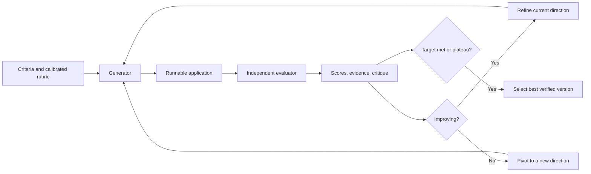
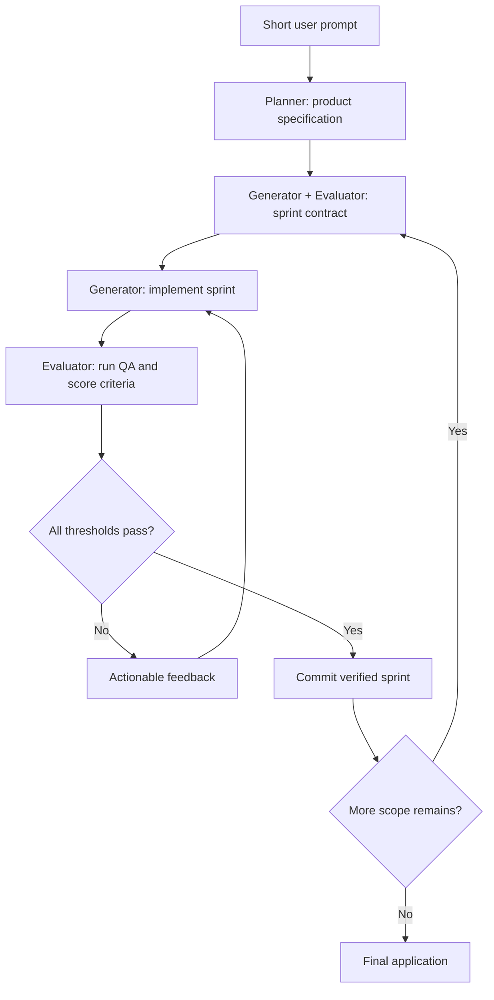

# Reading Note: Harness Design for Long-Running Application Development

[English](harness-design-long-running-apps.md) | [简体中文](harness-design-long-running-apps.zh-CN.md)

- Published: March 24, 2026
- Article: [Harness design for long-running application development](https://www.anthropic.com/engineering/harness-design-long-running-apps)
- Organization: based on the author's personal Notion reading notes

## 1. Two Interconnected Problems

The work began with two related goals:

1. Produce frontend designs with stronger quality and originality.
2. Build complete applications over long autonomous runs.

The earlier harness already supplied two important foundations:

- Decompose a large build into tractable chunks.
- Use structured artifacts to transfer state between contexts or agents.

Two limitations remained: long-context coherence and unreliable self-evaluation.

## 2. Why the Earlier Harness Still Failed

### Context Coherence and Context Anxiety

As a context fills, an agent can lose coherence or prematurely wrap up its work. A context reset
addresses this by starting a fresh agent with a structured handoff. It differs from compaction:

| Approach | Advantages | Disadvantages |
| --- | --- | --- |
| Context reset | Clean context; removes accumulated noise and stale assumptions; reduces premature wrap-up; supports a focused restart | Requires a complete handoff; can lose hidden details; adds orchestration, tokens, latency, and state reconstruction |
| Context compaction | Preserves conversational continuity; simpler orchestration; usually lower restart overhead | Summaries may omit or distort details; noise and stale assumptions may survive; does not provide a clean slate |

The choice is empirical and model-dependent. Context resets were useful for one model that showed
strong context anxiety, but became unnecessary when a later model maintained coherence with automatic
compaction. A harness component that once helped can become dead weight after a model upgrade.

### Self-Evaluation Bias

Agents tend to grade their own output too positively, especially on subjective work such as visual
design. Even when objective tests exist, the same agent that implemented a feature may overlook
problems or rationalize its decisions.

The solution is to separate the agent doing the work from the agent judging it. This does not make
the evaluator automatically correct, but it makes skeptical calibration and independent evidence
collection easier.

## 3. Generator–Evaluator Loop

The frontend experiment turned subjective quality into explicit criteria and used a separate
evaluator.

### Step 1: Define Evaluation Criteria

Define each dimension, its scoring rubric, weight, and failure threshold. Example dimensions are:

- Design coherence
- Originality
- Technical craft
- Functionality and usability

### Step 2: Calibrate the Evaluator

Provide few-shot examples with detailed scores and rationales. Calibration reduces score drift and
aligns the evaluator with the intended standard.

### Step 3: Generate an Initial Version

The generator creates a runnable version from the user request and the shared criteria.

### Step 4: Evaluate Through Interaction

The evaluator interacts with the running application, inspects evidence, scores every criterion, and
produces a specific, actionable critique.

### Step 5: Refine or Pivot

After each evaluation, the generator makes a strategic choice:

- Continue refining when scores and observed behavior improve.
- Pivot to a different approach when the direction stalls or fails.

### Step 6: Stop on Target or Plateau

Stop when the acceptance threshold is met or additional iterations no longer create meaningful
improvement. Preserve intermediate versions and select the best verified result, which may not be the
last iteration.

## 4. Three-Agent Application Harness

The full application harness uses Planner, Generator, and Evaluator roles.

### Planner

- Expands a short prompt into product scope and a full specification.
- Focuses on goals, user-visible deliverables, and high-level technical design.
- Avoids premature low-level implementation details whose mistakes could cascade downstream.

### Generator

- Implements the specification incrementally in sprints.
- Takes one bounded feature or coherent work unit at a time.
- Self-checks before handing the work to QA.
- Uses Git to preserve checkpoints and recover from regressions.

### Evaluator

- Tests the running application as a user would.
- Checks UI behavior, API endpoints, and database state.
- Scores product depth, functionality, visual design, and code quality.
- Rejects a sprint when any hard criterion is below threshold.
- Returns concrete evidence and repair instructions.

## 5. Sprint Contract

Before implementation, Generator and Evaluator agree on a sprint contract:

- What will be delivered in this sprint?
- What behavior is explicitly out of scope?
- How will each requirement be tested?
- What evidence counts as “done”?
- What score or hard threshold must be reached?

This contract connects a deliberately high-level product specification to a testable implementation
without over-specifying the technical solution too early.

## 6. Continuous Session vs. Context Reset

The second harness did not simply declare one context strategy universally superior. Its evolution
showed:

- Keep the **logical project state** external and durable in either case.
- Use compaction when the model preserves coherence and the summary retains enough information.
- Use reset plus structured handoff when accumulated context causes drift or premature completion.
- Re-evaluate the choice after every major model change.

This reinforces the distinction:

> Session != context window.

A continuous logical session may use compaction, several context windows, or fresh agents. The
harness should preserve contracts, files, tests, events, budgets, and outcomes independently of the
context strategy.

## 7. Evaluation Is Part of the Harness

The Evaluator is not just a final reviewer. It shapes the entire execution loop:

- Criteria influence the generator before the first implementation.
- The sprint contract defines verifiable completion.
- Interactive testing observes behavior that source inspection misses.
- Hard thresholds prevent partial success in one dimension from hiding failure in another.
- Historical scores reveal improvement, regression, and plateau.

The evaluator itself must also be evaluated. Few-shot calibration, deterministic tests, human spot
checks, and disagreement analysis can reveal evaluator bias or drift.

## 8. Costs and Failure Modes

A richer harness can improve output while increasing:

- Wall-clock latency from repeated build–test–fix cycles
- Model and tool cost
- Coordination overhead
- Context and artifact-management complexity
- Risk that an incorrect rubric steers every iteration in the wrong direction
- Risk that planner errors cascade into the specification and later sprints
- Risk that generator and evaluator converge on the same blind spots

The correct question is not “Does multi-agent look more sophisticated?” It is:

> Does this harness produce enough additional verified quality to justify its cost and failure surface?

## 9. Future Directions

- Remove harness scaffolding that no longer contributes after a model upgrade.
- Tune the harness using real tasks and execution traces instead of adding agents by intuition.
- Introduce specialized agents only where task decomposition or expertise creates measurable value.
- Re-run harness ablations after each major model change.
- Use stronger models to attempt harder tasks, rather than preserving obsolete workarounds unchanged.

## 10. Main Takeaway

The second-stage harness evolves from simple multi-session continuity into a quality-control system:
Planner defines scope, Generator works incrementally, and Evaluator enforces evidence-based completion.
Context strategy remains replaceable; durable artifacts, explicit contracts, and verified outcomes are
the stable core.

