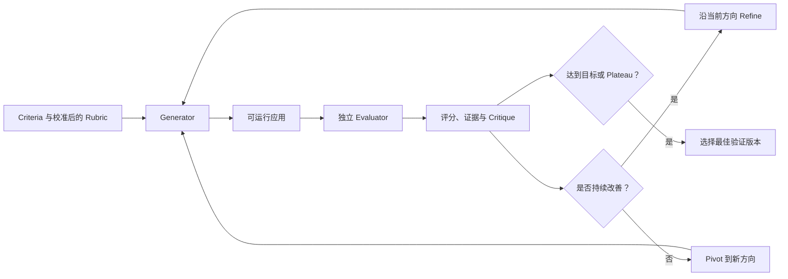
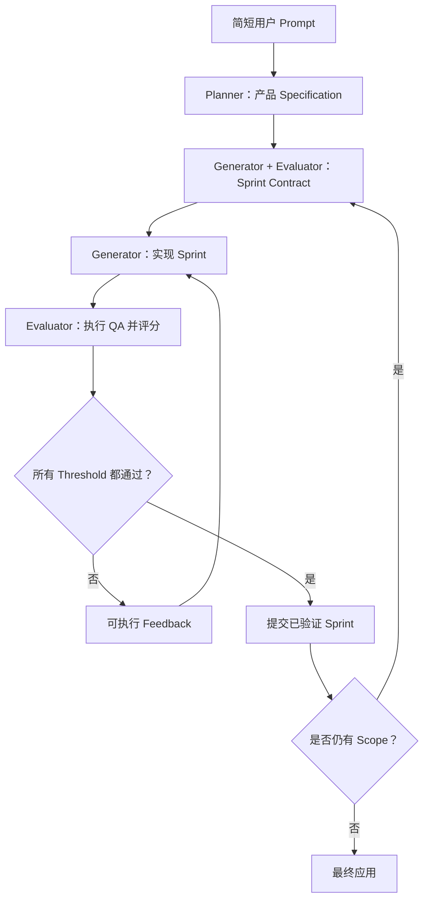

# 阅读笔记：Harness Design for Long-Running Application Development

[English](harness-design-long-running-apps.md) | [简体中文](harness-design-long-running-apps.zh-CN.md)

- 发布时间：2026 年 3 月 24 日
- 原文：[Harness design for long-running application development](https://www.anthropic.com/engineering/harness-design-long-running-apps)
- 组织方式：根据作者的个人 Notion 阅读记录整理

## 1. 两个相互关联的问题

这项工作最初有两个相关目标：

1. 让 Claude 生成质量和原创性更高的前端设计。
2. 让 Claude 能够在长时间自主运行中构建完整应用。

早期 Harness 已经提供两个重要基础：

- 将大型项目拆成可以完成的小块。
- 使用结构化 artifacts 在不同 context 或 Agent 之间传递状态。

但仍有两个主要问题：长上下文中的连贯性，以及不可靠的自我评价。

## 2. 为什么早期 Harness 仍然会失败？

### Context Coherence 与 Context Anxiety

随着 context 逐渐填满，Agent 可能失去连贯性，或过早结束工作。Context reset 通过结构化
handoff 启动一个全新的 Agent 来解决该问题。它与 compaction 的区别如下：

| 方法 | 优点 | 缺点 |
| --- | --- | --- |
| Context reset | 获得干净 context；移除累积噪声和过期假设；减少过早收尾；支持专注地重新开始 | 依赖完整 handoff；可能丢失隐含细节；增加编排、token、延迟和状态重建成本 |
| Context compaction | 保留对话连续性；编排较简单；通常具有更低的重启开销 | Summary 可能遗漏或扭曲细节；噪声和过期假设可能保留；无法提供完全干净的起点 |

选择哪种方式应该由实验决定，并且依赖具体模型。Context reset 对存在明显 context anxiety 的
模型有效；当更新后的模型可以通过自动 compaction 保持连贯时，reset 就可能成为额外负担。
曾经有效的 harness 组件，在模型升级后可能变成 dead weight。

### Self-Evaluation Bias

Agent 往往会对自己的输出给出过于积极的评价，尤其是在视觉设计等主观任务中。即使存在客观测试，
实现 feature 的同一个 Agent 也可能忽略问题，或为自己的实现寻找理由。

解决办法是将执行工作和判断质量的 Agent 分开。这不会让 Evaluator 自动变得正确，但可以更容易
对它进行怀疑式校准，并要求它收集独立证据。

## 3. Generator–Evaluator 循环

前端实验首先把主观质量转化为明确 criteria，然后使用独立 Evaluator。

### 第一步：定义 Evaluation Criteria

明确每个维度的定义、评分标准、权重和失败阈值，例如：

- 设计一致性
- 原创性
- 技术完成度
- 功能性与可用性

### 第二步：校准 Evaluator

提供包含详细分数和评分理由的 few-shot examples，降低 score drift，并使 Evaluator 与预期标准
对齐。

### 第三步：生成初始版本

Generator 根据用户请求和共享 criteria 创建一个可以运行的初始版本。

### 第四步：通过真实交互进行评测

Evaluator 操作运行中的应用、检查证据、分别评价每个 criterion，并提供具体且可执行的 critique。

### 第五步：Refine 或 Pivot

每次评测后，Generator 做出策略判断：

- 当分数和观察行为持续改善时，沿当前方向 refine。
- 当方向失败或进入停滞时，pivot 到不同方案。

### 第六步：达到目标或 Plateau 后停止

当结果达到验收阈值，或更多迭代不再带来明显提升时停止。保留中间版本，并选择经过验证的历史
最佳结果；最后一次迭代不一定是最佳版本。

## 4. 三 Agent 应用开发 Harness

完整应用 Harness 使用 Planner、Generator 和 Evaluator 三种角色。

### Planner

- 将简短 prompt 扩展为产品范围和完整 specification。
- 关注目标、用户可见的 deliverables 和高层技术设计。
- 避免过早指定底层实现细节，防止错误沿后续流程级联。

### Generator

- 以 sprint 为单位增量实现 specification。
- 每次选择一个有明确边界的 feature 或工作单元。
- 在交给 QA 前先进行自查。
- 使用 Git 保存 checkpoint，并从 regression 中恢复。

### Evaluator

- 像真实用户一样测试运行中的应用。
- 检查 UI、API endpoint 和数据库状态。
- 评价产品深度、功能、视觉设计和代码质量。
- 任何 hard criterion 低于阈值时拒绝该 sprint。
- 返回具体证据和修复说明。

## 5. Sprint Contract

实现开始前，Generator 与 Evaluator 共同确定 sprint contract：

- 这个 sprint 要交付什么？
- 哪些行为明确不在范围内？
- 每项需求如何测试？
- 什么证据才算 “done”？
- 必须达到什么分数或 hard threshold？

Sprint contract 在高层产品 specification 与可测试实现之间建立连接，同时避免过早规定技术方案。

## 6. Continuous Session 与 Context Reset

第二阶段 Harness 并没有宣布某一种 context 策略永远更好。它的演进说明：

- 无论使用哪种方式，都要将**逻辑项目状态**放在外部持久化层。
- 当模型能够保持连贯，且 summary 能保存足够信息时，可以使用 compaction。
- 当累积 context 导致 drift 或过早完成时，使用 reset + structured handoff。
- 每次重要模型升级后，重新评估这个选择。

这进一步说明：

> Session != Context Window

一个 continuous logical session 可以使用 compaction、多个 context window 或多个 fresh agent。
Harness 应独立保存 contract、文件、测试、事件、预算和 outcome。

## 7. Evaluation 是 Harness 的组成部分

Evaluator 不只是最终 Reviewer，它会影响完整执行循环：

- Criteria 在第一次实现之前就会影响 Generator。
- Sprint contract 定义可验证的完成条件。
- 交互式测试能够发现仅阅读源码无法发现的问题。
- Hard threshold 防止一个维度的局部成功掩盖其他维度的失败。
- 历史评分可以识别改进、regression 和 plateau。

Evaluator 本身也需要被评测。Few-shot calibration、确定性测试、人工抽查和分歧分析可以揭示
Evaluator bias 或 drift。

## 8. 成本与失败模式

更丰富的 Harness 可能改善输出，但也会增加：

- 多轮 build–test–fix 带来的墙钟延迟
- 模型和工具成本
- 协调开销
- Context 和 artifact 管理复杂度
- 错误 rubric 把所有迭代引向错误方向的风险
- Planner 错误级联到 specification 和后续 sprint 的风险
- Generator 与 Evaluator 共享相同盲点的风险

正确问题不是“Multi-Agent 是否看起来更高级”，而是：

> 这个 Harness 增加的 verified quality 是否足以抵消成本和新增失败面？

## 9. Future Directions

- 模型升级后，删除不再产生贡献的 harness scaffolding。
- 根据真实任务和执行轨迹调优 harness，而不是凭直觉增加 Agent。
- 只有当任务拆分或专业角色产生可测收益时，才增加 specialized agent。
- 每次重大模型变化后重新执行 harness ablation。
- 利用更强模型挑战更复杂任务，而不是永久保留已经过时的 workaround。

## 10. 核心结论

第二阶段 Harness 从简单的 multi-session continuity，演进成质量控制系统：Planner 定义范围，
Generator 增量工作，Evaluator 强制执行基于证据的完成标准。Context 策略可以替换；持久化 artifact、
明确 contract 和 verified outcome 才是稳定核心。

