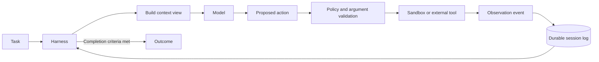
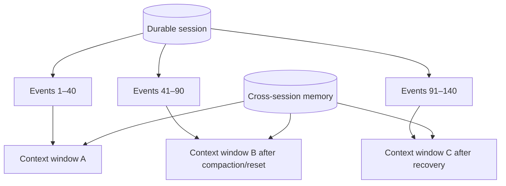

# Long-Running Agent Harness Evolution

[English](long-running-agent-harness-evolution.md) | [简体中文](long-running-agent-harness-evolution.zh-CN.md)

## Sources

1. [Effective harnesses for long-running agents](https://www.anthropic.com/engineering/effective-harnesses-for-long-running-agents) — November 26, 2025
2. [Harness design for long-running application development](https://www.anthropic.com/engineering/harness-design-long-running-apps) — March 24, 2026
3. [Scaling Managed Agents: Decoupling the brain from the hands](https://www.anthropic.com/engineering/managed-agents) — April 8, 2026
4. [Using agent memory](https://platform.claude.com/docs/en/managed-agents/memory) — Claude Platform documentation

Detailed article notes:

- [Effective Harnesses for Long-Running Agents](effective-harnesses-for-long-running-agents.md)
- [Harness Design for Long-Running Application Development](harness-design-long-running-apps.md)

## 1. What Is an Agent Harness?

An agent harness is the control plane around a model. It repeatedly constructs model input, calls
the model, validates and executes requested actions, records observations, manages budgets and
context, and decides whether to continue, pause, recover, or finish.

The model supplies reasoning and action proposals. The harness owns lifecycle, permissions,
execution, persistence, recovery, and stopping conditions.

## 2. How the Anthropic Harness Evolved

### Stage 1: Multi-Session Continuity Through Artifacts

The 2025 design addressed work that spans more than one context window. It used:

- An initializer session that creates the project environment and feature list
- Later coding sessions that implement one feature at a time
- A progress file and git history as durable handoff artifacts
- A startup procedure that reads the current state and runs a basic end-to-end test
- A clean-state rule at the end of every session

The important insight is that compaction alone does not guarantee a useful handoff. Future model
calls need explicit, inspectable artifacts that state what is done, what remains, how to run the
system, and whether the current version works.

### Stage 2: Context Reset and Generator–Evaluator Separation

The March 2026 design explored two modes:

- **Context compaction:** summarize older history while continuing the logical run.
- **Context reset:** start with a clean context and reconstruct the required state from a structured
  handoff.

The useful choice depends on model behavior. A reset can reduce context degradation, but introduces
handoff overhead and requires a sufficiently complete external state. As models changed, a reset
that had helped one model became unnecessary for another, demonstrating that harness assumptions
must be measured and revisited.

The design also expanded to three roles:

- **Planner:** converts a short request into product scope and high-level requirements.
- **Generator:** implements one sprint or feature at a time.
- **Evaluator:** tests the live application against an agreed sprint contract.

Separating generation from evaluation reduces self-grading bias, but costs additional model calls,
tool execution, and wall-clock time.

### Stage 3: Decoupling Brain, Hands, and Session

The April 2026 Managed Agents architecture split three replaceable interfaces:

- **Harness / brain:** model loop and tool-call routing
- **Sandbox / hands:** the environment that executes commands and edits files
- **Session:** the durable append-only event log

The sandbox can be reprovisioned after failure. The harness can also restart, replay the session log,
and resume from the last durable event. This removes the requirement that one container or process
survive for the entire task.

### Stage 4: Persistent Cross-Session Memory

A memory store carries selected knowledge across sessions, such as project conventions, user
preferences, domain context, and prior mistakes. It should be treated as a separate persistence
layer—not as an unlimited context window.

Persistent writable memory introduces a security risk: untrusted content can inject malicious or
incorrect instructions that later sessions read as trusted memory. Reference knowledge should be
read-only when possible, and every write should be attributable, reviewable, and recoverable.

## 3. Session Is Not a Context Window

| Concept | Lifetime | Primary contents | Typical limit or failure |
| --- | --- | --- | --- |
| Context window | One model call or a compacted conversational view | Tokens currently visible to the model | Token ceiling, lost detail, context degradation |
| Session | One logical agent run across many calls and possible resets | Durable events, status, budgets, outcomes | Runtime crash, event corruption, stuck lifecycle |
| Memory store | Across multiple sessions | Curated reusable knowledge | Staleness, poisoning, privacy leakage |
| Workspace/sandbox | As configured for execution | Files, processes, dependencies, artifacts | Container loss, unsafe side effects, environment drift |
| Harness | Recreated or upgraded independently | Control loop and orchestration policy | Bugs, stale assumptions, incompatible recovery logic |

A session may contain many model calls and many context windows. A context reset changes what the
next model call sees; it should not erase the session's event history, workspace artifacts, budgets,
or outcome state.

## 4. Selected Framework: OpenHands Software Agent SDK

We will use the [OpenHands Software Agent SDK](https://github.com/OpenHands/software-agent-sdk) as
the framework implementation after building a minimal harness from scratch.

Why it fits this learning plan:

- MIT-licensed and open source
- Model-agnostic LLM configuration
- A stateless, event-driven agent loop
- An append-only event log and conversation persistence/resume
- Local and remote workspaces behind a common conversation API
- Sandboxed command and file execution
- Context condensers for long histories
- Security analysis and lifecycle controls
- A direct contribution path to the existing OpenHands project

### Concept Mapping

| Harness concept | OpenHands SDK component |
| --- | --- |
| Logical session | `Conversation` / `ConversationState` |
| Durable history | `EventLog` and typed immutable events |
| Brain / action loop | Stateless `Agent` |
| Hands / execution | Local or remote `Workspace` and tools |
| Context compaction | `Condenser`, such as `LLMSummarizingCondenser` |
| Recovery | Conversation persistence and resume |
| Isolation | Remote Agent Server and container workspace |
| Safety | Security analyzer, tool validation, and secrets handling |

The [Claude Agent SDK](https://github.com/anthropics/claude-agent-sdk-python) remains a useful
secondary reference because the Anthropic experiments were implemented with it. OpenHands is the
primary learning framework because its orchestration and execution layers can be inspected,
modified, compared across model providers, and potentially contributed to upstream.

## 5. Integrated Harness Lab

### Week 3: Minimal Harness From Scratch

Implement a small loop with:

- Structured action and observation events
- Two tools: file read and a safe calculator or test runner
- Step, token, time, and cost budgets
- Explicit completion and failure states
- JSONL event logging

### Week 4: Durable Session and Recovery

- Give each logical run a session ID.
- Persist every committed event before executing the next step.
- Kill the process after a tool call, restart it, and recover from the log.
- Make side-effecting tools idempotent to prevent duplicate actions after replay.

### Week 5: Context and Memory

- Implement a rolling context view while retaining the full event log.
- Compare truncation, summarization/compaction, and reset with a structured handoff.
- Add project memory as small versioned files.
- Separate read-only reference memory from writable session memory.
- Test a memory-poisoning prompt and verify it cannot silently change trusted instructions.

### Week 6: Reimplement With OpenHands SDK

- Rebuild the same two-tool task using `Agent`, `Conversation`, tools, and a local workspace.
- Enable an `LLMSummarizingCondenser` with a deliberately small threshold.
- Pause, persist, and resume a conversation.
- Compare the SDK trace against the hand-written JSONL trace.
- Document what the framework solves and which policies remain application responsibilities.

### Weeks 7–9: Harness Evaluation

Create failure-injection tests:

- Process terminated between action and observation
- Tool timeout or malformed result
- Corrupted or incomplete handoff
- Context reset during an unfinished feature
- Duplicate side-effecting tool request
- Incorrect verifier result
- Writable memory exposed to untrusted content

Measure:

- Verified task success
- Resume success rate and resume overhead
- Progress lost after failure
- Context tokens and compaction loss
- Duplicate side effects
- Cost and wall-clock latency

### Weeks 10–12: Long-Running Project Demonstration

Run a multi-session task long enough to trigger compaction or reset. Produce an event timeline,
recovery demonstration, failure analysis, and ablation comparing:

1. One-shot agent
2. Persistent session without compaction
3. Persistent session with compaction
4. Persistent session with structured reset/handoff

## 6. Completion Criteria

The harness track is complete when:

- A session survives process restart without losing committed progress.
- Context can be compacted or reset without confusing it with session deletion.
- The same task runs on the handwritten harness and OpenHands SDK.
- Tool execution is bounded, validated, observable, and safe to retry.
- Memory ownership, access mode, versioning, and trust level are explicit.
- At least one harness design choice is supported by an ablation rather than intuition alone.
