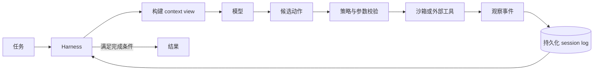
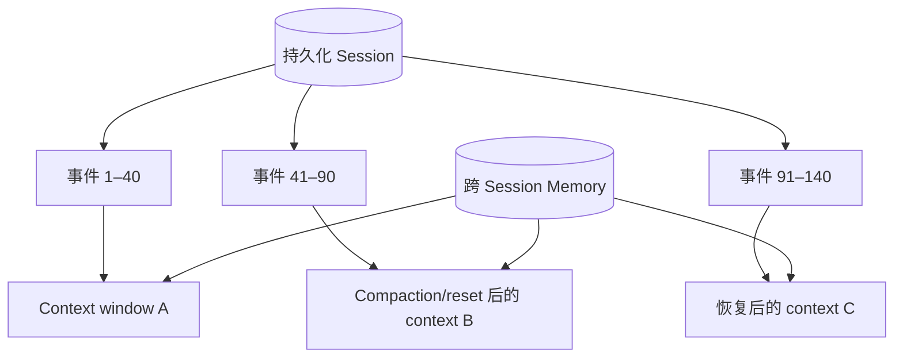

# Long-Running Agent Harness 演进

[English](long-running-agent-harness-evolution.md) | [简体中文](long-running-agent-harness-evolution.zh-CN.md)

## 资料来源

1. [Effective harnesses for long-running agents](https://www.anthropic.com/engineering/effective-harnesses-for-long-running-agents) — 2025 年 11 月 26 日
2. [Harness design for long-running application development](https://www.anthropic.com/engineering/harness-design-long-running-apps) — 2026 年 3 月 24 日
3. [Scaling Managed Agents: Decoupling the brain from the hands](https://www.anthropic.com/engineering/managed-agents) — 2026 年 4 月 8 日
4. [Using agent memory](https://platform.claude.com/docs/en/managed-agents/memory) — Claude Platform 文档

详细单篇笔记：

- [Effective Harnesses for Long-Running Agents](effective-harnesses-for-long-running-agents.zh-CN.md)
- [Harness Design for Long-Running Application Development](harness-design-long-running-apps.zh-CN.md)

## 1. 什么是 Agent Harness？

Agent harness 是模型周围的控制平面。它反复构造模型输入、调用模型、校验并执行模型请求的
动作、记录观察、管理预算与上下文，并决定继续、暂停、恢复还是结束。

模型负责推理和提出动作；harness 负责生命周期、权限、执行、持久化、恢复和停止条件。

## 2. Anthropic Harness 的演进

### 阶段一：通过外部产物实现多 Session 连续性

2025 年的设计解决跨越多个 context window 的长任务问题，主要使用：

- Initializer session 创建项目环境和 feature list
- 后续 coding session 每次只实现一个功能
- 使用 progress file 和 Git 历史作为持久化 handoff 产物
- 每个 session 启动时读取当前状态并执行基础端到端测试
- 每个 session 结束时保证代码处于 clean state

关键认识是：仅靠 compaction 不能保证有效交接。后续模型调用需要明确且可检查的外部产物，
记录已经完成什么、还有什么、如何启动系统，以及当前版本是否正常工作。

### 阶段二：Context Reset 与 Generator–Evaluator 分离

2026 年 3 月的设计探索了两种模式：

- **Context compaction：** 总结较早的历史，同时继续同一个逻辑任务。
- **Context reset：** 清空上下文，并通过结构化 handoff 重建必要状态。

选择哪一种取决于模型行为。Reset 可以减少长上下文退化，但会增加交接开销，并要求外部状态
足够完整。随着模型能力变化，原本对某个模型有效的 reset 可能对另一个模型成为多余开销，说明
harness 中的假设必须持续测量和重新验证。

该设计还扩展为三个角色：

- **Planner：** 将简短请求扩展为产品范围和高层需求。
- **Generator：** 每次完成一个 sprint 或 feature。
- **Evaluator：** 根据双方约定的 sprint contract 测试真实应用。

将生成和评测分离可以减轻自我评分偏差，但也会增加模型调用、工具执行和墙钟时间。

### 阶段三：Brain、Hands 与 Session 解耦

2026 年 4 月的 Managed Agents 架构将系统拆成三个可替换接口：

- **Harness / brain：** 模型循环与工具调用路由
- **Sandbox / hands：** 执行命令和编辑文件的环境
- **Session：** 持久化的 append-only event log

Sandbox 失败后可以重新创建；harness 失败后也可以重新启动、回放 session log，并从最后一个
持久化事件继续执行。整个任务不再依赖单一容器或进程始终存活。

### 阶段四：跨 Session 持久化 Memory

Memory store 在多个 session 之间保存经过选择的知识，例如项目约定、用户偏好、领域上下文和
过去的错误。它应该被视为单独的持久化层，而不是无限大的 context window。

可写的持久化 memory 会引入安全风险：不可信内容可能把恶意或错误指令写入 memory，随后被
其他 session 当作可信信息读取。参考知识应尽可能使用只读权限，每次写入都应该可归因、可审核、
可恢复。

## 3. Session 不等于 Context Window

| 概念 | 生命周期 | 主要内容 | 常见限制或失败 |
| --- | --- | --- | --- |
| Context window | 一次模型调用或压缩后的对话视图 | 模型当前能够看到的 token | token 上限、细节丢失、上下文退化 |
| Session | 跨越多次调用和 reset 的一次逻辑 Agent 运行 | 持久化事件、状态、预算和结果 | runtime 崩溃、事件损坏、生命周期卡死 |
| Memory store | 跨越多个 session | 经过整理的可复用知识 | 过期、污染、隐私泄露 |
| Workspace/sandbox | 按执行需求配置 | 文件、进程、依赖和产物 | 容器丢失、不安全副作用、环境漂移 |
| Harness | 可以独立重建或升级 | 控制循环和编排策略 | 程序缺陷、假设过期、恢复逻辑不兼容 |

一个 session 可以包含多次模型调用和多个 context window。Context reset 只改变下一次模型调用
能够看到的内容，不应该删除 session event history、workspace 产物、预算或 outcome 状态。

## 4. 选定框架：OpenHands Software Agent SDK

在手写最小 harness 之后，本计划选择
[OpenHands Software Agent SDK](https://github.com/OpenHands/software-agent-sdk) 作为框架实现。

它适合本学习计划的原因：

- MIT License 开源项目
- 支持相对模型无关的 LLM 配置
- Stateless、event-driven 的 Agent loop
- Append-only event log 和 Conversation 持久化/恢复
- Local 与 remote workspace 共用 Conversation API
- 沙箱化的命令和文件执行
- 用于长历史的 context condenser
- Security analysis 和生命周期控制
- 可以向现有 OpenHands 项目提交上游贡献

### 概念映射

| Harness 概念 | OpenHands SDK 组件 |
| --- | --- |
| 逻辑 Session | `Conversation` / `ConversationState` |
| 持久化历史 | `EventLog` 和强类型不可变事件 |
| Brain / action loop | Stateless `Agent` |
| Hands / execution | Local 或 remote `Workspace` 和 tools |
| Context compaction | `Condenser`，例如 `LLMSummarizingCondenser` |
| Recovery | Conversation persistence 和 resume |
| Isolation | Remote Agent Server 和容器 workspace |
| Safety | Security analyzer、工具校验和 secrets handling |

[Claude Agent SDK](https://github.com/anthropics/claude-agent-sdk-python) 仍然是有价值的对照资料，
因为 Anthropic 的实验基于它实现。OpenHands 被选为主要学习框架，是因为其编排与执行层可以被
阅读、修改、跨模型供应商比较，并有机会贡献回上游项目。

## 5. 整合后的 Harness 实验路线

### 第 3 周：从零实现最小 Harness

实现一个包含以下能力的小型循环：

- 结构化 action 和 observation event
- 两个工具：文件读取，以及安全计算器或测试运行器
- 步数、token、时间和成本预算
- 明确的完成与失败状态
- JSONL event logging

### 第 4 周：持久化 Session 与恢复

- 为每次逻辑运行分配 session ID。
- 每个已确认事件必须先持久化，再执行下一步。
- 在工具调用后主动终止进程，重启后从 event log 恢复。
- 让具有副作用的工具满足幂等性，避免 replay 后重复执行。

### 第 5 周：Context 与 Memory

- 保留完整 event log，同时实现滚动 context view。
- 比较截断、总结/compaction，以及带结构化 handoff 的 reset。
- 使用小型、版本化文件保存 project memory。
- 分离只读 reference memory 与可写 session memory。
- 构造 memory poisoning prompt，确认它无法静默修改可信指令。

### 第 6 周：使用 OpenHands SDK 重新实现

- 使用 `Agent`、`Conversation`、tools 和 local workspace 重建相同的双工具任务。
- 用较小阈值启用 `LLMSummarizingCondenser`，主动触发压缩。
- 暂停、持久化并恢复一个 Conversation。
- 比较 SDK trace 与手写 JSONL trace。
- 记录框架解决了什么，以及哪些策略仍然属于应用责任。

### 第 7–9 周：Harness 评测

建立 failure injection tests：

- 进程在 action 和 observation 之间终止
- Tool timeout 或返回畸形结果
- Handoff 损坏或信息不完整
- 未完成功能时触发 context reset
- 重复请求具有副作用的工具
- Verifier 返回错误判断
- 可写 memory 接触不可信内容

测量：

- Verified task success
- 恢复成功率和恢复开销
- 故障后丢失的进度
- Context token 和 compaction 信息损失
- 重复副作用
- 成本和墙钟延迟

### 第 10–12 周：Long-Running 项目演示

执行一个足够长、必然触发 compaction 或 reset 的多 session 任务，生成 event timeline、恢复演示、
失败分析，以及以下消融对比：

1. One-shot agent
2. 无 compaction 的持久化 session
3. 带 compaction 的持久化 session
4. 带结构化 reset/handoff 的持久化 session

## 6. 完成标准

Harness 学习线只有在满足以下条件后才算完成：

- 进程重启后 session 能够恢复，且不丢失已提交进度。
- Context 可以被 compaction 或 reset，且不会与删除 session 混淆。
- 同一个任务能够分别在手写 harness 和 OpenHands SDK 上运行。
- 工具执行有边界、经过校验、可观察，并且可以安全重试。
- Memory 的所有者、访问模式、版本和信任级别均被明确记录。
- 至少一个 harness 设计决策由消融实验支持，而不只是凭直觉选择。
