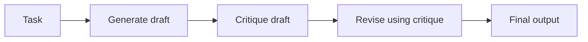
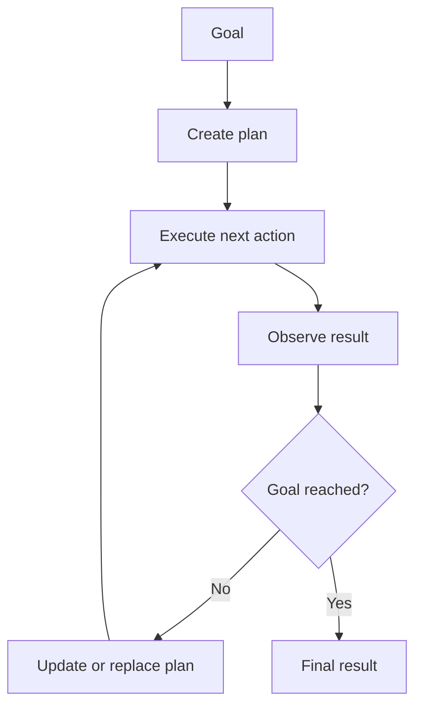
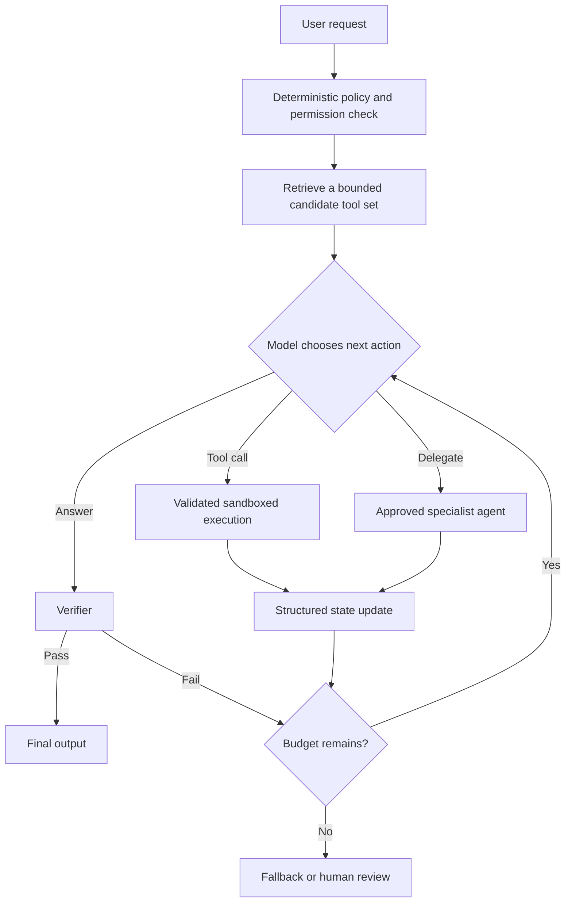

# Week 1 Reading Note: Four Agentic Design Patterns

[English](week01-agentic-design-patterns.md) | [简体中文](week01-agentic-design-patterns.zh-CN.md)

Source series:

- [Overview: Four Agentic Design Patterns](https://www.deeplearning.ai/the-batch/how-agents-can-improve-llm-performance/)
- [Reflection](https://www.deeplearning.ai/the-batch/agentic-design-patterns-part-2-reflection)
- [Tool Use](https://www.deeplearning.ai/the-batch/agentic-design-patterns-part-3-tool-use/)
- [Planning](https://www.deeplearning.ai/the-batch/agentic-design-patterns-part-4-planning/)
- [Multi-Agent Collaboration](https://www.deeplearning.ai/the-batch/agentic-design-patterns-part-5-multi-agent-collaboration)

## 1. The Four Patterns

### 1.1 Reflection

Reflection asks an LLM to inspect an earlier output, identify problems, and produce an improved
version. A minimal fixed loop is:

The critic can be:

- The same model prompted to review its own output
- A separately prompted critic agent
- A stronger or specialized model
- An external evaluator such as unit tests, a compiler, a web search system, or a formal verifier

External evidence is usually more useful than unconstrained self-critique. For example, a coding
agent can run unit tests, inspect the failure output, and revise the code. However, reflection is not
guaranteed to improve an answer: a weak critic may invent a problem, overlook a real error, or cause
the reviser to replace a correct answer with an incorrect one.

Suggested papers:

- [Self-Refine: Iterative Refinement with Self-Feedback](https://arxiv.org/abs/2303.17651)
- [Reflexion: Language Agents with Verbal Reinforcement Learning](https://arxiv.org/abs/2303.11366)
- [CRITIC: Large Language Models Can Self-Correct with Tool-Interactive Critiquing](https://arxiv.org/abs/2305.11738)

### 1.2 Tool Use

Tool use lets a model request external functions to retrieve information, perform computation, or
change the environment. Examples include web search, code execution, databases, calendars, and
email.

When a system exposes hundreds of tools, placing every tool definition in the prompt is expensive
and can reduce selection accuracy. A tool-retrieval layer can first select a small candidate set:

- **Keyword matching:** map terms such as “weather” or “email” to relevant tool groups.
- **Task classification/routing:** classify the request before loading tools for search, code,
  calendar, databases, and so on.
- **Embedding similarity:** rank tool descriptions against the request:

  \[
  \operatorname{sim}(q, t_i) = \cos(E(q), E(t_i))
  \]

  Then expose only the top-k tools.
- **Rule filtering:** remove unavailable, unauthorized, destructive, or irrelevant tools.
- **Contextual signals:** prioritize tools related to earlier actions and observations.

The host application—not the model—should enforce authentication, authorization, argument
validation, timeouts, and confirmation for high-impact actions.

Suggested papers:

- [Gorilla: Large Language Model Connected with Massive APIs](https://arxiv.org/abs/2305.15334)
- [MM-REACT: Prompting ChatGPT for Multimodal Reasoning and Action](https://arxiv.org/abs/2303.11381)
- [Efficient Tool Use with Chain-of-Abstraction Reasoning](https://arxiv.org/abs/2401.17464)

### 1.3 Planning

Planning lets the LLM choose a sequence of steps for a goal that cannot be completed with one model
call or one tool invocation. A research agent might decompose a topic, search for each subtopic,
synthesize the evidence, identify missing information, and revise the plan.

Planning becomes genuinely dynamic when the next step is selected from the current observation,
rather than read from a workflow written before execution. This flexibility also makes behavior less
predictable and harder to test.

Suggested papers:

- [Chain-of-Thought Prompting Elicits Reasoning in Large Language Models](https://arxiv.org/abs/2201.11903)
- [HuggingGPT: Solving AI Tasks with ChatGPT and its Friends in Hugging Face](https://arxiv.org/abs/2303.17580)
- [Understanding the Planning of LLM Agents: A Survey](https://arxiv.org/abs/2402.02716)

### 1.4 Multi-Agent Collaboration

Multi-agent systems assign different contexts, tools, or roles to multiple agents. A software task,
for example, might use product-manager, engineer, reviewer, and test-engineer roles.

Specialization can improve focus and enable parallel work, but more agents do not automatically
produce a better result. They can repeat work, lose information during handoffs, reinforce the same
mistake, or spend many tokens debating without changing the output.

Suggested papers:

- [Communicative Agents for Software Development](https://arxiv.org/abs/2307.07924)
- [AutoGen: Enabling Next-Gen LLM Applications via Multi-Agent Conversation](https://arxiv.org/abs/2308.08155)
- [MetaGPT: Meta Programming for a Multi-Agent Collaborative Framework](https://arxiv.org/abs/2308.00352)

## 2. Which Patterns Are Predefined Workflows?

None of the four patterns is inherently a workflow or inherently an autonomous agent. The
classification depends on **who determines the control flow at runtime**.

| Pattern | Predefined workflow | Dynamic agent behavior |
| --- | --- | --- |
| Reflection | Always run generate → critique → revise once | Decide whether another revision is needed, choose an evaluator, and stop dynamically |
| Tool use | Application always calls a known tool in a fixed position | Model chooses whether to call a tool, which tool to use, and with what arguments |
| Planning | Developer writes all steps in advance | Model creates, reorders, removes, or replaces steps from observations |
| Multi-agent | Fixed roles and handoffs follow a static graph | System dynamically delegates, creates specialists, requests help, or changes ownership |

Examples such as “generate, always critique once, then revise once” are predefined workflows even
if every node contains an LLM. Conversely, a single-agent loop can be highly dynamic if the model
selects its next action from the current state.

**Agentic behavior is a spectrum, not a binary label.** A robust system often combines a fixed outer
workflow with carefully bounded model decisions inside it.

## 3. Which Decisions Should Be Dynamic?

Useful model-controlled decisions include:

- Classifying or routing the request
- Selecting a tool and generating its arguments
- Decomposing a goal into subtasks
- Selecting the next action from new observations
- Revising a plan after a failed action
- Choosing which specialist agent receives a subtask
- Deciding whether more evidence is required
- Proposing that the task is complete

Some decisions should remain under deterministic application control:

- Which tools and data the model is authorized to access
- Whether a write, purchase, deletion, or external message requires approval
- Maximum steps, tokens, time, retries, and cost
- Tool argument validation and sandboxing
- Whether tests or other acceptance criteria actually pass
- Final handling when the budget is exhausted

The model may **propose** completion, but a verifier or host policy should **decide** whether the
completion conditions have been met.

## 4. Latency and Error-Propagation Risks of Agent Loops

### 4.1 Latency and Cost

For a serial loop, total latency grows approximately with the sum of all model and tool calls:

\[
L_{total} \approx \sum_{i=1}^{n}(L_{model,i} + L_{tool,i}) + L_{orchestration}
\]

Every additional reflection, retry, replan, or handoff adds tokens and waiting time. Parallel agents
can reduce wall-clock latency toward the slowest branch, but usually increase total inference cost
and require a later aggregation step.

Longer trajectories also enlarge the context. This increases inference cost and may bury important
observations among irrelevant messages.

### 4.2 Error Propagation

Agent loops introduce several compounding failure modes:

- **Cascading assumptions:** an early incorrect observation becomes the premise of later steps.
- **Critic contamination:** a mistaken critique causes a correct answer to be revised incorrectly.
- **Tool misuse:** the right tool is called with the wrong arguments, or the wrong tool is selected.
- **Verifier error:** false positives accept bad work; false negatives trigger unnecessary retries.
- **Context pollution:** failed attempts remain in context and bias later decisions.
- **Oscillation:** the system alternates between incompatible revisions or plans.
- **Non-termination:** no reliable stopping rule exists, so the agent loops until its budget expires.
- **Handoff loss:** multi-agent messages omit constraints, evidence, or state.
- **Shared hallucination:** multiple agents accept and amplify the same unsupported claim.
- **Side-effect amplification:** repeated tool calls send duplicate messages or perform duplicate writes.
- **Concurrency conflicts:** parallel agents edit the same state or act on stale observations.

As a rough intuition, if each of `n` dependent steps succeeds with probability `p`, then an
independence approximation gives end-to-end success near `p^n`. Real agent steps are not independent,
but the expression illustrates why adding steps without better verification can reduce reliability.

### 4.3 Practical Controls

- Set explicit step, token, latency, retry, and cost budgets.
- Prefer deterministic evaluators such as tests when available.
- Validate tool arguments and make side-effecting operations idempotent where possible.
- Keep a structured state instead of treating the entire chat transcript as memory.
- Require evidence for important claims and preserve the evidence across handoffs.
- Use confidence thresholds and escalate uncertain, high-impact tasks to humans.
- Evaluate every additional loop with an ablation: does it improve verified success enough to justify
  its latency, cost, and new failure modes?

## 5. A Bounded Agent Architecture

This design keeps the dynamic decisions that benefit from model reasoning while reserving
permissions, budgets, execution, and acceptance criteria for deterministic control.

