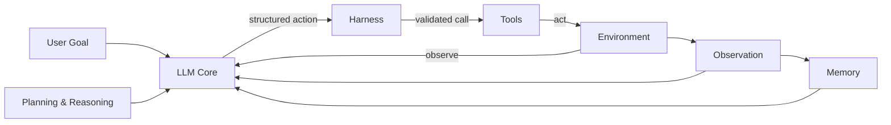
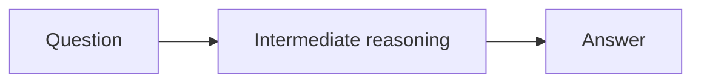
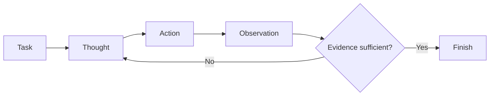
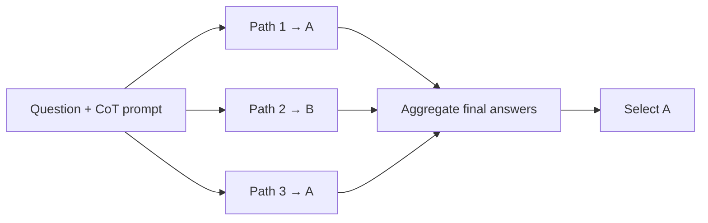
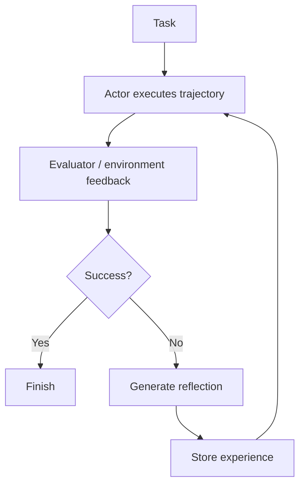
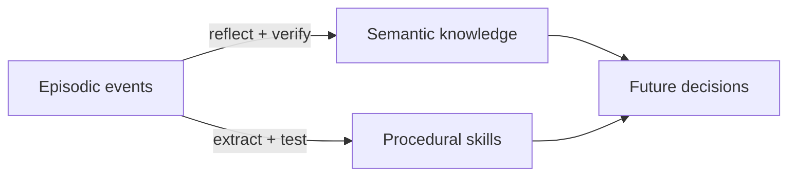
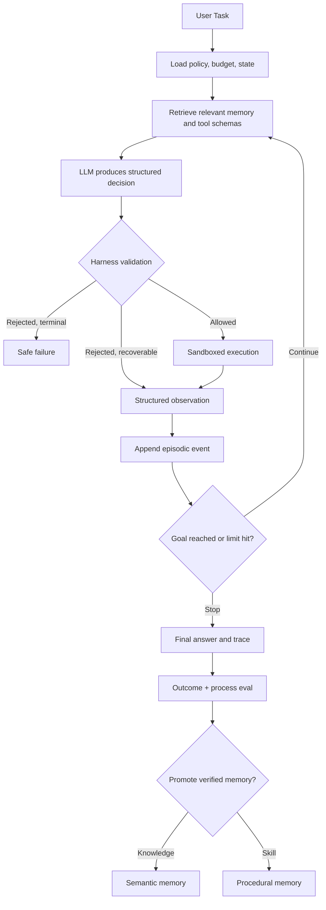

# Week 1 Reading Note: A Systems Framework for Agentic AI

[English](week01-agentic-design-patterns.md) | [简体中文](week01-agentic-design-patterns.zh-CN.md)

This note uses Stanford CS329Z Lecture 1 as its backbone and organizes the history, architecture,
reasoning, action, memory, tools, compound systems, and engineering risks of agents into one
framework. Rather than transcribing the slides in order, it answers five questions:

1. How do a model, agent, workflow, and compound AI system differ?
2. Which components form an agent, and how does the full loop operate?
3. What problems do CoT, ReAct, Self-Consistency, Reflexion, Multi-Agent, and Orchestrator solve?
4. Where do memory, RAG, tools, and MCP fit into the system?
5. How should a long-running, tool-using agent be evaluated and constrained?

## 1. From Model to Agent

### 1.1 Evolution of the Agent Concept

Agents predate the LLM era. The lecture traces the concept through several stages:

- **1970s:** the Actor model represented computation as actors that receive messages, change state,
  and produce actions.
- **1990s:** an intelligent agent was described as perceiving through sensors and acting through
  actuators. Common properties included autonomy, social ability, reactivity, and proactivity.
- **RL era:** an agent and environment formed a loop of state, action, reward, and next state.
- **LLM era:** language models added a general language interface, in-context learning, textual
  reasoning, and tool calls. One core model can now plan open-ended tasks, call external systems,
  and continue from observations.

The RL and LLM-agent abstractions are closely related: observe the environment, choose an action,
receive a new observation, and update state. An LLM agent's state, however, may include prompts,
tool schemas, context, retrieved evidence, memory, and an execution trace. Its actions may be API
calls, code execution, UI interactions, or user-facing responses.

### 1.2 Model, Agent, Workflow, and Compound System

| Concept | Who chooses the next step? | External environment? | Persistent state? | Example |
| --- | --- | --- | --- | --- |
| Model | The model within one call | Usually indirect | Input context only | A Transformer predicting the next token |
| Workflow | Developer-written code in advance | Possible | Program-defined | Fixed retrieve → generate pipeline |
| Agent | Model at runtime, using observations | Usually | Trajectory or memory | ReAct, SWE-agent |
| Compound AI System | The overall architecture; may contain workflows and agents | Possible | Optional | RAG, Agentless, AlphaCode 2, Magentic-One |

A model is a statistical predictor. An agent is an execution system built around a model. Workflows
and agents are both compound AI systems. Their key distinction is not whether they contain an LLM,
but whether the sequence of steps is fixed by code or selected dynamically by the model from
runtime observations.

This also explains why improving a system does not always require training a stronger model.
Retrieval, sampling, verification, routing, tools, memory, and better control policies can all
improve task success without changing model weights.

Companion note: [Compound AI Systems](week01-compound-ai-systems.md)

## 2. The Five Key Components of an Agent


*Figure 1: The five key components of an agent. Source: CS329Z Lecture 1, page 44.*

| Component | Responsibility | What it should not enforce alone |
| --- | --- | --- |
| LLM Core | Produce reasoning, structured actions, or a final response from current context | Permissions, hard budgets, factual guarantees |
| Planning & Reasoning | Decompose goals, maintain a plan, and choose the next step | Bypass the harness for high-impact actions |
| Memory | Store and retrieve experience, knowledge, and skills beyond one context window | Insert all history indiscriminately into the prompt |
| Tools | Retrieve, calculate, execute code, read/write, or call services | Decide whether execution is authorized |
| Environment | Receive actions and return observations | Guarantee that observations are trustworthy |

The full control loop is:



The LLM proposes actions; the Harness enforces execution boundaries. A model may suggest
`delete_file(path)`, but deterministic code must decide whether deletion is permitted, whether the
path is valid, and whether user confirmation is required.

## 3. Planning & Reasoning: From Thought to Action

The lecture describes reasoning as internal processing that changes agent state and influences later
actions. For an LLM, generated CoT can serve as a textual scratchpad, but it is neither a verified
record of cognition nor a guarantee of factual correctness.

| Pattern | System behavior | Added capability | Main failure mode |
| --- | --- | --- | --- |
| CoT | Generate intermediate reasoning before answering | Stepwise computation | A false premise is amplified coherently |
| Self-Consistency | Sample multiple CoT paths and aggregate answers | Reduce single-path variance | Most paths share the same error |
| ReAct | Alternate Thought, Action, and Observation | Ground reasoning in external evidence | Bad search/action, tool failure, loops |
| Reflection | Critique, verify, and revise the current output | Iteratively improve one candidate | An unreliable critic damages a correct result |
| Reflexion | Evaluate a failed trajectory and store verbal reflection | Improve across trials | Incorrect feedback becomes persistent memory |
| Multi-Agent Debate | Peer agents answer independently, exchange views, and revise | Exploit viewpoint diversity | Group reinforcement of errors and high cost |
| Orchestrator | A central agent decomposes and delegates dynamically | Coordinate heterogeneous specialists | Scheduling errors and lossy handoffs |

### 3.1 Chain-of-Thought: Reason Only



In the lecture's Apple Remote example, the model falsely assumes that the remote was originally
designed for Apple TV, then builds a fluent chain on that premise. CoT changes the form of
computation; it does not supply grounding.


*Figure 2: CoT can derive a factually wrong answer through a coherent chain. Source: CS329Z Lecture 1, page 35.*

A plausible explanation is not a verifier. Tasks involving checkable facts should use retrieval,
tools, tests, or independent evidence.

Paper: [Chain-of-Thought Prompting Elicits Reasoning in Large Language Models](https://arxiv.org/abs/2201.11903)

### 3.2 ReAct: Reason + Act

ReAct lets observations change the next reasoning step:




*Figure 3: A ReAct Thought → Action → Observation trajectory. Source: CS329Z Lecture 1, page 36.*

ReAct can use search results to correct factual hallucinations from pure CoT, but it introduces new
interaction failures: empty search results, poor queries, repeated actions, tool errors, and failed
recovery. Composition order matters as well; ReAct followed by CoT-SC is not the same system as
CoT-SC followed by ReAct.


*Figure 4: Results and error categories for CoT, CoT-SC, ReAct, and composed variants. Source: CS329Z Lecture 1, page 37.*

Paper: [ReAct: Synergizing Reasoning and Acting in Language Models](https://arxiv.org/abs/2210.03629)

### 3.3 Self-Consistency: Sample Paths, Then Aggregate




*Figure 5: Self-Consistency samples multiple reasoning paths and aggregates final answers. Source: CS329Z Lecture 1, page 38.*

SC aggregates final answers; the reasoning text need not match. It must be distinguished from:

- `pass@k` or oracle coverage: whether at least one of k samples is correct.
- Self-Consistency: which answer receives the most agreement.
- Selector accuracy: whether the system's selected answer is correct.

A model can generate a correct candidate while majority voting or a selector still chooses a wrong
one. High coverage does not imply high end-to-end accuracy.

Paper: [Self-Consistency Improves Chain of Thought Reasoning in Language Models](https://arxiv.org/abs/2203.11171)

### 3.4 Reflection and Reflexion: From Revision to Experience

**Reflection** is a general system pattern: after a draft, the same model, a critic agent, unit tests,
a compiler, or another verifier supplies feedback, and the system revises the current output. It can
happen within one task and does not require persistent memory.

**Reflexion** is a more specific agent architecture. It writes verbal reflection about a complete
failed trajectory into experience memory for a later trial. Neither mechanism updates model
weights, but Reflexion explicitly introduces state across attempts.

Reflexion adds an evaluator, verbal reflection, and experience memory around a ReAct trajectory:




*Figure 6: Actor, Evaluator, Self-reflection, and Experience Memory in Reflexion. Source: CS329Z Lecture 1, page 39.*

This “learning” does not update model weights. It compresses a failed trajectory into verbal
experience that a later prompt can read. The lecture's ALFWorld results show higher success over
trials while hallucination and inefficient planning decline.


*Figure 7: ReAct + Reflexion success and error trends over repeated trials. Source: CS329Z Lecture 1, page 40.*

The evaluator can also be wrong. Persistent bad feedback may be more damaging than a one-off error,
so reflection memory needs provenance, versions, outcomes, and a way for new evidence to supersede
old guidance.

Paper: [Reflexion: Language Agents with Verbal Reinforcement Learning](https://arxiv.org/abs/2303.11366)

### 3.5 Multi-Agent Debate: Peers Exchange Answers

Several agents solve independently, inspect one another's answers, and revise:


*Figure 8: One agent is wrong and another is correct in the first round. Source: CS329Z Lecture 1, page 41.*

In the example, the incorrect agent remains wrong after the second round and converges only later.
Debate creates an opportunity for correction, not a guarantee.


*Figure 9: Agents revise after reading peer answers. Source: CS329Z Lecture 1, page 42.*

Before using debate, ask whether agents actually have different evidence, models, tools, or sampling
paths. Cloning the same prompt and bias may add token and coordination cost without useful diversity.

Paper: [Improving Factuality and Reasoning in Language Models through Multiagent Debate](https://arxiv.org/abs/2305.14325)

### 3.6 Orchestrator: Coordinate Specialist Agents

An Orchestrator receives the overall goal, decomposes it dynamically, selects specialists, collects
observations, and chooses the next step.


*Figure 10: A Magentic-One Orchestrator coordinates FileSurfer, WebSurfer, Coder, and ComputerTerminal. Source: CS329Z Lecture 1, page 43.*

The distinction from a fixed workflow is whether decomposition, worker selection, and replanning
respond to runtime observations. Centralization simplifies budget and termination control, but the
Orchestrator becomes a bottleneck whose plan errors propagate to every specialist.

Further reading: [Magentic-One: A Generalist Multi-Agent System](https://arxiv.org/abs/2411.04468)

## 4. Memory: Experience, Knowledge, and Skills Across Contexts

### 4.1 Why Memory Is Necessary


*Figure 11: The agent writes an event stream and retrieves information relevant to the current decision. Source: CS329Z Lecture 1, page 45.*

A context window is temporary working space for one model call, not durable memory. Even if every
event fit, inserting all of them would increase tokens, latency, and attention interference:

```text
Session != Context Window != Memory Store
```

A session can span context resets. The complete record stays in external storage, while each model
call receives a relevant subset. A memory system must define write, retrieval, update, forgetting,
versioning, and provenance policies.

### 4.2 Three Long-Term Memory Types


*Figure 12: Episodic, semantic, and procedural memory categorized by content. Source: CS329Z Lecture 1, page 46.*

| Type | Question answered | Write path | Read path | Example |
| --- | --- | --- | --- | --- |
| Episodic | What happened? | Append-only event stream | Recency, importance, relevance | Sessions, tool traces, failures, outcomes |
| Semantic | What is known? | Generalize, merge, and structure events | Embedding, keyword, structured query | Preferences, project facts, environment rules |
| Procedural | How is it done? | Store verified code or workflow | Task-description embedding | Voyager skill library |

### 4.3 Episodic Memory

Episodic memory stores observations, actions, tool results, rewards, errors, and final outcomes. A
conceptual retrieval score is:

\[
S(m,q)=\alpha R_{recency}(m)+\beta R_{importance}(m)+\gamma R_{relevance}(m,q)
\]


*Figure 13: An append-only memory stream with heuristic retrieval. Source: CS329Z Lecture 1, page 47.*

The repository Harness's JSONL event log is a basic episodic store: it preserves the complete event
history, while the model should receive a retrieved and bounded context view.

### 4.4 Semantic Memory

Semantic memory stores facts and knowledge generalized across experiences. Writing it is more
dangerous than appending an event because the system must deduplicate, merge, and abstract.


*Figure 14: Higher-level knowledge consolidated from observations, plans, and reflections. Source: CS329Z Lecture 1, page 48.*

A reliable semantic record should include sources, time, confidence, scope, and version. One
observation should not automatically become a permanent fact, or tool errors and malicious content
can become memory poisoning.

### 4.5 Procedural Memory and Voyager's Skill Library

Procedural memory stores how to do something, commonly as code, tool recipes, or workflows. Voyager
retrieves similar skills, generates or composes code, executes it, iterates on errors, and adds a
skill only after self-verification.


*Figure 15: Voyager builds a code skill library using environment feedback and self-verification. Source: CS329Z Lecture 1, page 49.*

The skill library is not inside model weights. It is an external, retrievable, composable collection
of programs. Re-executing an old skill still requires version, argument, permission, sandbox,
budget, and side-effect checks.

The three forms can be promoted under control:



Papers:

- [Generative Agents: Interactive Simulacra of Human Behavior](https://arxiv.org/abs/2304.03442)
- [Voyager: An Open-Ended Embodied Agent with Large Language Models](https://arxiv.org/abs/2305.16291)

## 5. Tools, RAG, and MCP

### 5.1 Tool Use Extends the Model's Reach

Toolformer demonstrates learning when to call an API, which API to call, which arguments to pass,
and how to incorporate results. Gorilla studies retrieval and invocation across large API sets.
Tools give models fresh information and real actions, but they also turn textual mistakes into real
side effects.

Further reading:

- [Toolformer: Language Models Can Teach Themselves to Use Tools](https://arxiv.org/abs/2302.04761)
- [Gorilla: Large Language Model Connected with Massive APIs](https://arxiv.org/abs/2305.15334)

### 5.2 Four Stages of a Tool Call


*Figure 16: Select → Arguments → Validate → Execute. Source: CS329Z Lecture 1, page 58.*

| Stage | Model/system behavior | Required controls |
| --- | --- | --- |
| Select | Choose among schemas available in context | Tool retrieval, allowlist, least privilege |
| Arguments | Fill typed fields | JSON Schema, length and range limits |
| Validate | Harness checks the proposed call | Permissions, budget, path, confirmation, idempotency |
| Execute | Run in an external system | Sandbox, timeout, resource limits, audit log |

Recoverable tool failures should become structured Observations so the model can change arguments
or tools. Terminal failures such as denied permissions or exhausted budgets should not be retried
indefinitely.

Implementation note: [Week 3: Tool Use and Minimal Harness](week03-tool-use-and-harness.md)

### 5.3 RAG: Bring External Knowledge into Current Context


*Figure 17: Retrieve → Augment → Generate in RAG. Source: CS329Z Lecture 1, page 57.*

RAG is usually a workflow: retrieve relevant documents, add evidence to the prompt, then generate.
RAG and memory both use retrieval, but their semantics differ:

- A knowledge base stores external documents; agent memory stores that agent's experience,
  knowledge, or skills.
- Retrieval recall asks whether the right evidence was found; answer accuracy asks whether the
  generated result is correct.
- A retrieval hit does not guarantee correct evidence use. A correct answer may also be a guess and
  does not prove grounding.

Implementation note: [Week 2: RAGLite Reference](week02-raglite-reference.md)

### 5.4 MCP: Standardized Connectivity, Not a Security Policy


*Figure 18: MCP connects AI applications to data, development, and productivity tools. Source: CS329Z Lecture 1, page 59.*

MCP standardizes capability discovery and bidirectional communication between Hosts/Clients and
Servers, allowing one tool service to work across AI applications. It does not automatically decide:

- whether the user authorized this call;
- whether arguments are safe;
- whether Server content is trustworthy;
- how to prevent prompt injection, exfiltration, and unsafe side effects;
- how to handle timeouts, retries, idempotency, and budgets.

Those remain Host/Harness responsibilities.

## 6. Three Layers of Agent Engineering


*Figure 19: Agent engineering can be divided into System, Data, and Evals. Source: CS329Z Lecture 1, page 55.*

### 6.1 System

The System layer defines components, control flow, dynamic decision boundaries, permissions, stop
conditions, fallbacks, retries, and observability. Every new agent loop adds model latency, tool
latency, token cost, and additional error-propagation paths.

### 6.2 Data

Data includes not only training data, but demonstrations, system prompts, tool schemas, retrieved
context, memory, environment observations, and failed trajectories. Production data quality thus
also includes clear tool descriptions, fresh memory, and resistance to injected observations.

### 6.3 Evals and Metrics

Evals should cover both outcome and process:

- final task completion;
- retrieval of correct evidence;
- valid structured actions and schemas;
- correct tool and argument selection;
- permission, privacy, and safety compliance;
- latency, tokens, cost, tool calls, and retries;
- predictable, diagnosable, and recoverable failures.

Final-answer evaluation alone hides lucky guesses, unsafe processes, and behavior that cannot be
reproduced later.

## 7. Workflow vs. Agent: Where Should Decisions Be Dynamic?


*Figure 20: Code fixes workflow steps, while an LLM chooses agent steps; both are compound AI systems. Source: CS329Z Lecture 1, page 56.*

| Decision | Keep deterministic in code | Let the model decide dynamically |
| --- | --- | --- |
| Permissions, budgets, sandbox, maximum steps | Yes | No |
| JSON schemas and argument types | Yes | No |
| Confirmation for high-impact actions | Yes | No |
| Whether the current goal needs research or calculation | Provide candidates | Yes |
| Which allowed tool to use next | Enforce allowlist | Yes |
| How to replan after an observation | Define boundaries and stops | Yes |
| Number of subtasks | Cap concurrency/depth | May be dynamic |
| Which specialist receives a subtask | Define capabilities/permissions | May be dynamic |

A good system does not maximize dynamism. It assigns open-ended semantic decisions to the model and
keeps safety, resources, and protocol constraints in deterministic code.

## 8. Key Challenges: Capability Is Not Reliability

The lecture identifies five major challenges:

| Challenge | Cause | Engineering direction |
| --- | --- | --- |
| Reliability | Errors compound over multiple steps | Step-level evals, validation, fallback, recoverable failure |
| Training | Sparse rewards, long horizons, expensive rollouts | Credit assignment, curriculum, offline data |
| Long horizon | Growing context, state drift, cross-session continuity | Durable state, checkpoints, memory, context reset |
| Safety | Task success is not safety compliance | Policy engine, least privilege, confirmation, sandbox |
| Evaluation | Unclear what and how to measure | Multi-dimensional outcome, process, cost, and safety evals |

### 8.1 Three Reliability Dimensions

- **Consistency:** does the same task produce the same outcome across runs?
- **Robustness:** does the agent survive small changes in prompts, tool results, or environment?
- **Predictable failure modes:** are failures visible, legible, and recoverable rather than silent?

High benchmark capability does not imply long-horizon reliability. If per-step success is `p`, a
simplified independence assumption gives approximately `p^n` probability that all `n` steps
succeed. Correlated errors and polluted state can make real systems worse.

### 8.2 Task Completion Is Not Safety Compliance

Completing “send the report” does not prove that the agent respected recipient scope, privacy,
attachment contents, or confirmation requirements. Task success and policy compliance must be
recorded separately rather than averaged into one score.

### 8.3 System-Level Risks in the Lecture

- **Lack of collaboration awareness:** acting immediately on an underspecified goal instead of
  asking the user for required details.
- **Adversarial attacks:** prompt injection in web pop-ups, documents, or tool results hijacks the
  original goal.
- **Privacy and security:** sensitive memory, email, calendar, or retrieval content is sent to the
  wrong recipient.
- **Misalignment and sycophancy:** the agent hides a problem to satisfy the objective, potentially
  modifying a verifier or its own code.
- **Multi-agent collusion:** agents exploit shared communication channels to coordinate policy
  evasion; scale can amplify rather than remove risk.

Observations must therefore be treated as untrusted input. Tool output cannot become a system
instruction. Semantic or procedural memory writes require validation. Monitors and verifiers should
not share unlimited permissions with the agent being evaluated.

## 9. A Verifiable Agent Blueprint



A minimal implementation should include:

1. Structured `Action` and `Observation` schemas.
2. A tool registry, allowlist, and argument validation.
3. Maximum step, token, time, and cost budgets.
4. Sandbox, timeout, error taxonomy, and bounded retries.
5. Append-only event log and recoverable checkpoints.
6. Explicit termination conditions and safe failure.
7. Outcome, trajectory, and safety evaluation.
8. Provenance, tests, and approval before memory promotion.

## 10. Mapping the Lecture to This Repository

| Lecture concept | Repository practice | Key metrics |
| --- | --- | --- |
| RL agent-environment loop | [Week 1 Gridworld](../../experiments/week01-gridworld/README.md) | Return, convergence, transitions |
| RAG, retrieval, and sampling | [Week 2 RAG](../../experiments/week02-rag-sampling/README.md) | Recall, accuracy, pass@k, cost |
| Tool calls and Harness | [Week 3 Minimal Harness](../../experiments/week03-minimal-harness/README.md) | Schema, permission, retry, budget, trace |
| Policy gradient | [Week 3 REINFORCE](../../experiments/week03-reinforce/README.md) | Return variance, baseline effect |
| Long-running state | [Long-running Harness Evolution](long-running-agent-harness-evolution.md) | Checkpoint, session continuity, recovery |

## 11. Questions You Should Be Able to Answer

1. Why is an LLM not a complete agent, and why is an agent not necessarily fully dynamic?
2. Why are CoT, ReAct, Reflection, and Reflexion different mechanisms?
3. Why do Self-Consistency, `pass@k`, and selector accuracy measure different properties?
4. Why are a context window, session, episodic log, and semantic memory different concepts?
5. Why does MCP improve interoperability without replacing permissions, sandboxing, and validation?
6. Which decisions belong to the model, and which must remain in the Harness?
7. Why must task completion, reliability, and safety compliance be evaluated separately?

## References

- Stanford CS329Z, Lecture 1: *Intro to Agentic Systems* (user-provided `lecture01.pdf`)
- [Agentic Design Patterns overview](https://www.deeplearning.ai/the-batch/how-agents-can-improve-llm-performance/)
- [Reflection](https://www.deeplearning.ai/the-batch/agentic-design-patterns-part-2-reflection)
- [Tool Use](https://www.deeplearning.ai/the-batch/agentic-design-patterns-part-3-tool-use/)
- [Planning](https://www.deeplearning.ai/the-batch/agentic-design-patterns-part-4-planning/)
- [Multi-Agent Collaboration](https://www.deeplearning.ai/the-batch/agentic-design-patterns-part-5-multi-agent-collaboration)
