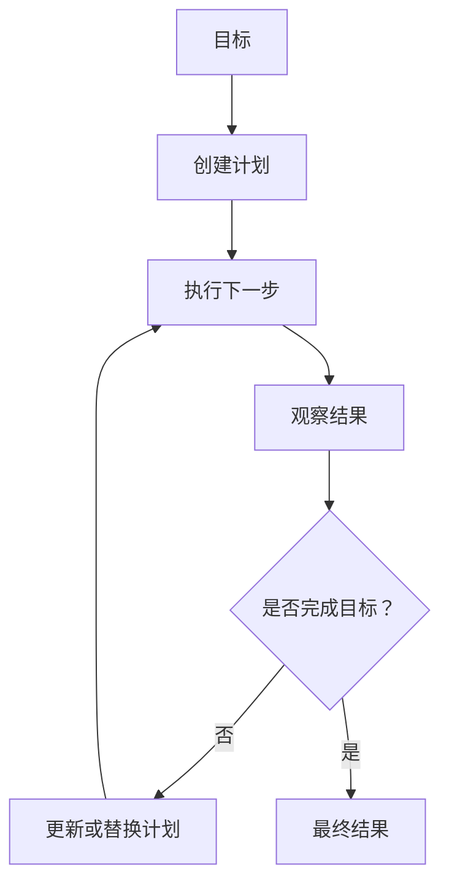
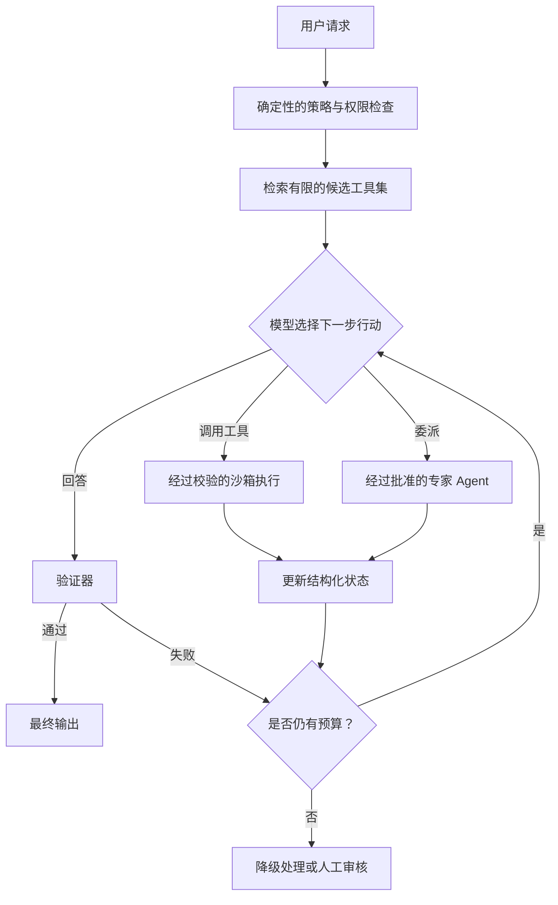

# 第一周阅读笔记：四种 Agentic Design Patterns

[English](week01-agentic-design-patterns.md) | [简体中文](week01-agentic-design-patterns.zh-CN.md)

原文系列：

- [总览：四种 Agentic Design Patterns](https://www.deeplearning.ai/the-batch/how-agents-can-improve-llm-performance/)
- [Reflection](https://www.deeplearning.ai/the-batch/agentic-design-patterns-part-2-reflection)
- [Tool Use](https://www.deeplearning.ai/the-batch/agentic-design-patterns-part-3-tool-use/)
- [Planning](https://www.deeplearning.ai/the-batch/agentic-design-patterns-part-4-planning/)
- [Multi-Agent Collaboration](https://www.deeplearning.ai/the-batch/agentic-design-patterns-part-5-multi-agent-collaboration)

## 1. 四种设计模式

### 1.1 Reflection

Reflection 让 LLM 检查先前输出、发现问题，并生成改进版本。最简单的固定循环是：

Critic 可以是：

- 通过不同提示词检查自身输出的同一个模型
- 单独设置的 critic agent
- 更强或更专业的模型
- 单元测试、编译器、网页搜索或形式化 verifier 等外部评估器

外部证据通常比不受约束的自我批评更有价值。例如，Coding Agent 可以运行单元测试、读取失败
信息，再修改代码。但是 Reflection 并不保证输出一定变好：较弱的 critic 可能虚构问题、遗漏
真实错误，或者让 reviser 把正确答案改错。

延伸阅读：

- [Self-Refine: Iterative Refinement with Self-Feedback](https://arxiv.org/abs/2303.17651)
- [Reflexion: Language Agents with Verbal Reinforcement Learning](https://arxiv.org/abs/2303.11366)
- [CRITIC: Large Language Models Can Self-Correct with Tool-Interactive Critiquing](https://arxiv.org/abs/2305.11738)

### 1.2 Tool Use

Tool Use 允许模型请求外部函数，以检索信息、执行计算或改变环境，例如网页搜索、代码执行、
数据库、日历和电子邮件。

当系统提供数百个工具时，把所有工具定义都放入 prompt 不仅昂贵，还可能降低选择准确率。
因此可以先通过工具检索层选出较小的候选集合：

- **关键词匹配：** 将 “weather”“email” 等词映射到相关工具组。
- **任务分类/路由：** 先将请求分类为搜索、代码、日历、数据库等，再加载对应工具。
- **Embedding 相似度：** 比较用户请求和工具描述：

  \[
  \operatorname{sim}(q, t_i) = \cos(E(q), E(t_i))
  \]

  然后只向模型提供 Top-K 工具。
- **规则过滤：** 排除未连接、未授权、具有破坏性或与任务无关的工具。
- **上下文线索：** 根据前面的动作和观察优先选择相关工具。

身份验证、授权、参数校验、超时，以及高影响操作的确认，都应该由宿主应用执行，而不是交给
模型自行约束。

延伸阅读：

- [Gorilla: Large Language Model Connected with Massive APIs](https://arxiv.org/abs/2305.15334)
- [MM-REACT: Prompting ChatGPT for Multimodal Reasoning and Action](https://arxiv.org/abs/2303.11381)
- [Efficient Tool Use with Chain-of-Abstraction Reasoning](https://arxiv.org/abs/2401.17464)

### 1.3 Planning

Planning 让 LLM 为无法通过一次模型调用或一次工具调用完成的目标选择执行步骤。例如，研究型
Agent 可以拆分主题、搜索各个子主题、综合证据、识别信息缺口，并据此修改计划。

如果系统根据当前观察选择下一步，而不是机械执行开发者事先写好的步骤，Planning 才真正具有
动态性。这种灵活性也使系统行为更难预测和测试。

延伸阅读：

- [Chain-of-Thought Prompting Elicits Reasoning in Large Language Models](https://arxiv.org/abs/2201.11903)
- [HuggingGPT: Solving AI Tasks with ChatGPT and its Friends in Hugging Face](https://arxiv.org/abs/2303.17580)
- [Understanding the Planning of LLM Agents: A Survey](https://arxiv.org/abs/2402.02716)

### 1.4 Multi-Agent Collaboration

Multi-Agent 系统为多个 Agent 设置不同的上下文、工具或角色。例如，一个软件项目可以设置产品
经理、工程师、Reviewer 和测试工程师等角色。

角色专业化可以提升专注度，也可以支持并行执行；但 Agent 更多并不代表结果必然更好。不同
Agent 可能重复工作、在 handoff 中丢失信息、共同强化同一个错误，或者花费大量 token 争论，
最终却没有改善输出。

延伸阅读：

- [Communicative Agents for Software Development](https://arxiv.org/abs/2307.07924)
- [AutoGen: Enabling Next-Gen LLM Applications via Multi-Agent Conversation](https://arxiv.org/abs/2308.08155)
- [MetaGPT: Meta Programming for a Multi-Agent Collaborative Framework](https://arxiv.org/abs/2308.00352)

## 2. 哪些只是预定义 Workflow？

这四种模式都不天然属于 Workflow，也不天然属于自主 Agent。判断依据是：**运行时由谁决定控制流**。

| 模式 | 预定义 Workflow | 动态 Agent 行为 |
| --- | --- | --- |
| Reflection | 固定执行一次“生成 → 批评 → 修改” | 动态决定是否继续修改、选择何种评估器以及何时停止 |
| Tool Use | 应用在固定位置调用预先指定的工具 | 模型决定是否调用工具、选择哪个工具以及使用什么参数 |
| Planning | 开发者提前写好全部步骤 | 模型根据观察创建、重排、删除或替换步骤 |
| Multi-Agent | 固定角色按照静态图进行 handoff | 系统动态委派、创建专家、请求帮助或改变任务负责人 |

即使每个节点都使用 LLM，“生成一次、固定批评一次、固定修改一次”仍然是预定义 Workflow。
相反，如果单 Agent 根据当前状态选择下一步，它也可以具有很强的动态性。

**Agentic behavior 是一个连续谱，而不是二元标签。** 可靠系统通常使用固定的外层 Workflow，
并在内部只开放经过约束的模型决策点。

## 3. 哪些步骤真正由模型动态决定？

适合由模型动态决定的内容包括：

- 对请求进行分类或 routing
- 选择工具并生成工具参数
- 将目标分解为子任务
- 根据新观察选择下一步行动
- 行动失败后修改计划
- 决定由哪个 specialist agent 处理子任务
- 判断是否需要收集更多证据
- 提议任务已经完成

以下决定应该由确定性的宿主应用控制：

- 模型被授权访问哪些工具和数据
- 写入、购买、删除和对外发送消息是否需要审批
- 最大步数、token、时间、重试次数和成本
- 工具参数校验和沙箱隔离
- 测试或其他验收条件是否真正通过
- 预算耗尽后的最终处理方式

模型可以**提议**任务已经完成，但应该由 verifier 或宿主策略**判定**完成条件是否满足。

## 4. Agent Loop 增加的延迟与错误传播风险

### 4.1 延迟与成本

对于串行循环，总延迟近似等于所有模型调用和工具调用耗时之和：

\[
L_{total} \approx \sum_{i=1}^{n}(L_{model,i} + L_{tool,i}) + L_{orchestration}
\]

每增加一次 reflection、retry、replan 或 handoff，都会增加 token、成本和等待时间。并行 Agent
可以把墙钟延迟降低到接近最慢分支的耗时，但通常会提高总推理成本，并且需要额外的结果聚合。

更长的轨迹也会扩大上下文，增加推理成本，并可能让重要观察被大量无关消息掩盖。

### 4.2 错误传播

Agent loop 会引入多种累积性失败：

- **错误假设级联：** 早期错误观察成为后续步骤的前提。
- **Critic 污染：** 错误批评导致正确答案被改错。
- **工具误用：** 选错工具，或者正确工具使用了错误参数。
- **Verifier 错误：** 假阳性接受错误结果，假阴性触发无意义重试。
- **上下文污染：** 失败尝试保留在上下文中，影响后续判断。
- **振荡：** 系统反复切换互不兼容的修改或计划。
- **无法终止：** 缺少可靠停止条件，只能等预算耗尽。
- **Handoff 丢失：** 多 Agent 消息遗漏约束、证据或状态。
- **共享幻觉：** 多个 Agent 接受并放大同一个无依据结论。
- **副作用放大：** 重复调用工具，导致重复发送消息或重复写入。
- **并发冲突：** 并行 Agent 修改相同状态，或基于过期观察行动。

可以用一个粗略模型建立直觉：如果 `n` 个相互依赖的步骤各自成功率为 `p`，在独立性假设下，
端到端成功率约为 `p^n`。真实 Agent 步骤并不独立，但这个表达式说明：如果没有更好的验证，
单纯增加步骤可能降低整体可靠性。

### 4.3 实用控制措施

- 设置明确的步数、token、延迟、重试和成本预算。
- 存在单元测试等确定性评估器时，优先使用它们。
- 校验工具参数，并尽量让具有副作用的操作满足幂等性。
- 使用结构化状态，不要把完整聊天记录直接当作记忆。
- 对重要结论要求证据，并确保 handoff 时保留证据。
- 对不确定且高影响的任务设置置信度阈值和人工升级机制。
- 对每个新增循环进行消融实验：它带来的 verified success 提升，是否足以抵消新增的延迟、成本和失败模式？

## 5. 一个有边界的 Agent 架构

这种设计保留了适合模型推理的动态决策，同时把权限、预算、执行和验收条件留给确定性控制层。

