# 第一周阅读笔记：Agentic Systems 全景框架

[English](week01-agentic-design-patterns.md) | [简体中文](week01-agentic-design-patterns.zh-CN.md)

本笔记以 Stanford CS329Z Lecture 1 为主线，将 Agent 的历史、架构、推理、行动、记忆、工具、
复合系统和工程风险组织为一个统一框架。它不是按幻灯片顺序逐页摘录，而是回答五个核心问题：

1. Model、Agent、Workflow 和 Compound AI System 有什么区别？
2. 一个 Agent 由哪些组件组成，完整闭环如何运行？
3. CoT、ReAct、Self-Consistency、Reflexion、Multi-Agent 和 Orchestrator 分别解决什么问题？
4. Memory、RAG、Tools 和 MCP 在系统中处于什么位置？
5. 如何评价并约束一个会长期运行、会调用工具的 Agent？

## 1. 从 Model 到 Agent

### 1.1 Agent 概念的演进

Agent 并不是 LLM 时代才出现的概念。课件给出的历史主线是：

- **1970s：** Actor model 已经把计算表示为可接收消息、改变状态并产生动作的 actor。
- **1990s：** 智能 Agent 被描述为通过传感器感知环境、通过 actuator 行动的实体；常见特征包括
  autonomy、social ability、reactivity 和 proactivity。
- **RL 时代：** Agent 与 Environment 形成状态、动作、奖励和下一状态的循环。
- **LLM 时代：** LLM 提供了通用语言接口、in-context learning、推理文本和工具调用能力，使同一
  个核心模型可以在开放式任务中规划、调用外部系统并根据 observation 继续执行。

RL 与 LLM Agent 的抽象其实一致：Agent 观察环境、选择动作、接收新观察，并持续更新内部状态。
区别在于 LLM Agent 的 state 往往同时包含 prompt、工具 schema、短期上下文、检索结果、记忆和
执行轨迹；动作也可能是结构化 API 调用、代码执行、UI 操作或面向用户的回答。

### 1.2 Model、Agent、Workflow 与 Compound System

| 概念 | 谁决定下一步 | 是否接触外部环境 | 是否保存状态 | 典型例子 |
| --- | --- | --- | --- | --- |
| Model | 单次调用中的模型 | 通常不直接接触 | 仅依赖输入上下文 | Transformer 预测下一个 token |
| Workflow | 开发者代码预先固定 | 可以 | 由程序决定 | 固定的 retrieve → generate pipeline |
| Agent | 模型根据 observation 动态决定 | 通常会 | 需要 trajectory 或 memory | ReAct、SWE-agent |
| Compound AI System | 由系统架构决定，可包含 workflow 和 agent | 可以 | 可选 | RAG、Agentless、AlphaCode 2、Magentic-One |

模型是统计预测器；Agent 是围绕模型构建的执行系统；Workflow 和 Agent 都属于 Compound AI
System。真正区分 Workflow 与 Agent 的问题不是“有没有 LLM”，而是：**运行时的步骤主要由代码
预先确定，还是由模型根据当前 observation 动态选择？**

这也解释了为什么改进系统不一定要训练更强的模型：检索、采样、验证、路由、工具、记忆和更好
的控制策略，都可能在不改变模型权重的情况下提高任务成功率。

延伸笔记：[Compound AI Systems](week01-compound-ai-systems.zh-CN.md)

## 2. Agent 的五个关键组件

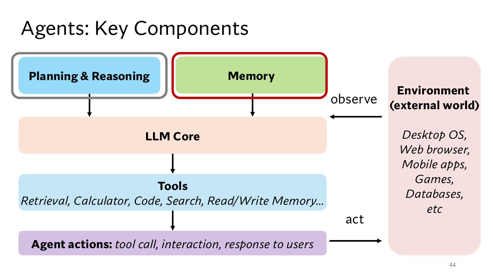

*图 1：Agent 的五个关键组件。来源：CS329Z Lecture 1，第 44 页。*

| 组件 | 职责 | 不应该独自负责的事情 |
| --- | --- | --- |
| LLM Core | 根据当前上下文产生推理、结构化 action 或最终回答 | 权限控制、预算强制、结果真实性保证 |
| Planning & Reasoning | 分解目标、维护计划、选择下一步 | 绕过 Harness 直接执行高风险动作 |
| Memory | 保存并检索 context window 之外的经历、知识和技能 | 把所有历史无差别塞回 prompt |
| Tools | 检索、计算、执行代码、读写文件或调用服务 | 自行决定是否有权执行 |
| Environment | 接收动作并返回 observation 的外部世界 | 保证 observation 一定可信或无恶意内容 |

完整控制循环是：

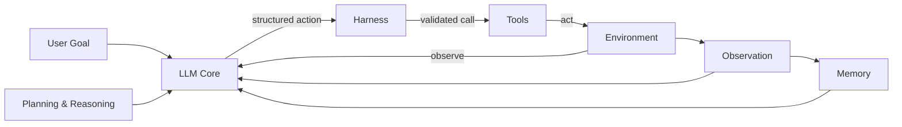
```mermaid
flowchart LR
    U[User Goal] --> C[LLM Core]
    P[Planning & Reasoning] --> C
    M[Memory] --> C
    E[Environment] -->|observe| C
    C -->|structured action| H[Harness]
    H -->|validated call| T[Tools]
    T -->|act| E
    E --> O[Observation]
    O --> M
    O --> C
```

图中的 LLM 负责提出动作，Harness 负责验证和执行边界。把这两种责任分开非常重要：模型可以
建议 `delete_file(path)`，但是否允许删除、路径是否合法、是否需要用户确认，必须由确定性系统
判断。

## 3. Planning & Reasoning：从思考到行动

课件把 reasoning 描述为会影响 Agent state 和后续 action 的内部过程。对 LLM 来说，生成的 CoT
是可用于计算的文本 scratchpad，但它不等于可验证的真实思维过程，也不保证事实正确。

| Pattern | 系统做了什么 | 新增能力 | 主要失败模式 |
| --- | --- | --- | --- |
| CoT | 先生成中间推理，再回答 | 分步计算 | 错误前提被连贯地放大 |
| Self-Consistency | 采样多条 CoT 并聚合答案 | 降低单路径偶然错误 | 多数路径共享同一错误 |
| ReAct | Thought、Action、Observation 交替 | 用外部证据修正推理 | 搜索失败、坏 action、循环 |
| Reflection | 对当前输出批评、验证并修改 | 迭代改善一个候选结果 | critic 不可靠或把正确答案改错 |
| Reflexion | 对完整失败轨迹评估并写入语言反思 | 跨 trial 改进 | 错误反馈变成错误记忆 |
| Multi-Agent Debate | Peer agents 独立作答、交换观点并修正 | 利用观点多样性 | 群体强化错误、讨论成本高 |
| Orchestrator | 中央 Agent 动态拆分和分配子任务 | 协调异构 specialist | 调度错误、handoff 信息损失 |

### 3.1 Chain-of-Thought：Reason Only


```mermaid
flowchart LR
    Q[Question] --> R[Intermediate reasoning]
    R --> A[Answer]
```

课件中的 Apple Remote 案例显示：模型错误地假定 Apple Remote 最初用于 Apple TV，随后在错误
前提上生成了一条流畅的推理链。CoT 改进的是计算形式，不会自动提供 grounding。

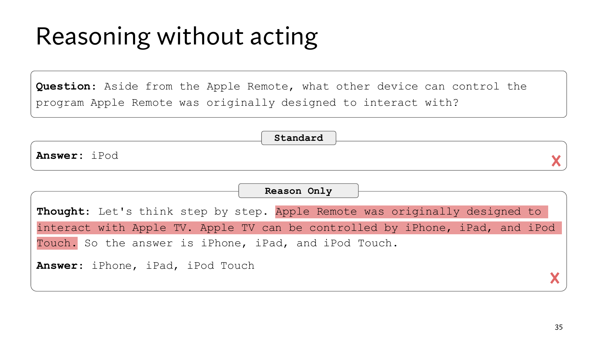

*图 2：CoT 可以连贯地推导出事实错误的答案。来源：CS329Z Lecture 1，第 35 页。*

因此，不能把“解释听起来合理”当作 verifier。涉及可查询事实时，应引入检索、工具、测试或独立
证据。

论文：[Chain-of-Thought Prompting Elicits Reasoning in Large Language Models](https://arxiv.org/abs/2201.11903)

### 3.2 ReAct：Reason + Act

ReAct 允许 observation 改变下一步推理：

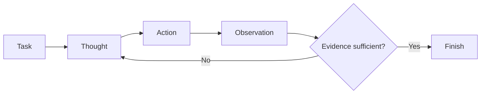
```mermaid
flowchart LR
    Q[Task] --> T[Thought]
    T --> A[Action]
    A --> O[Observation]
    O --> D{Evidence sufficient?}
    D -->|No| T
    D -->|Yes| F[Finish]
```

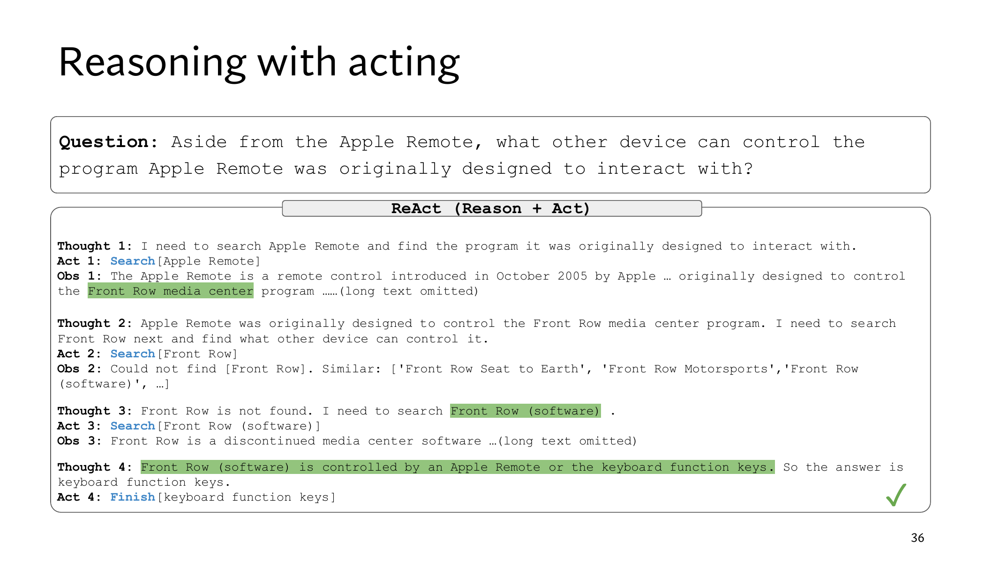

*图 3：ReAct 的 Thought → Action → Observation 轨迹。来源：CS329Z Lecture 1，第 36 页。*

ReAct 可以用搜索结果纠正纯 CoT 的事实幻觉，但会引入新的交互失败：空搜索结果、错误查询、
重复动作、工具错误和恢复失败。组件组合顺序也会改变系统行为；先 ReAct 后 CoT-SC，与先 CoT-SC
后 ReAct 不是同一个系统。

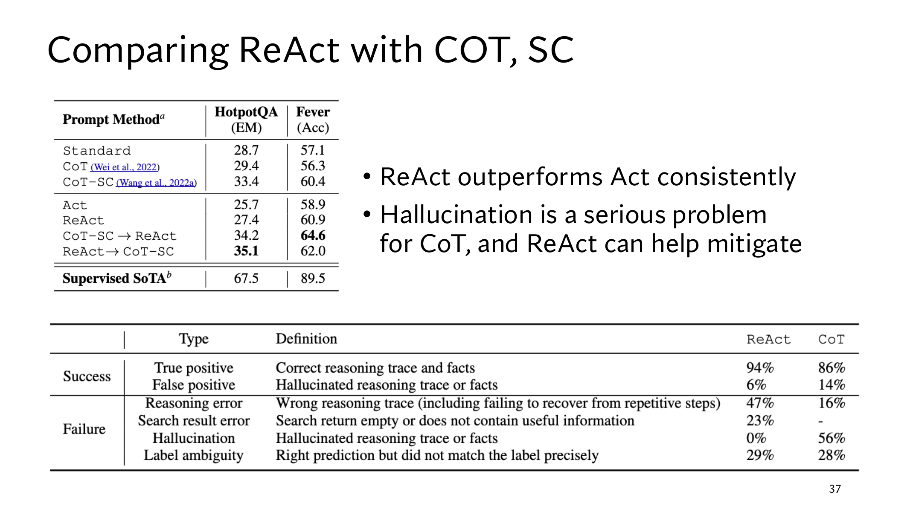

*图 4：CoT、CoT-SC、ReAct 及组合方法的结果和错误类型。来源：CS329Z Lecture 1，第 37 页。*

论文：[ReAct: Synergizing Reasoning and Acting in Language Models](https://arxiv.org/abs/2210.03629)

### 3.3 Self-Consistency：多路径采样后聚合

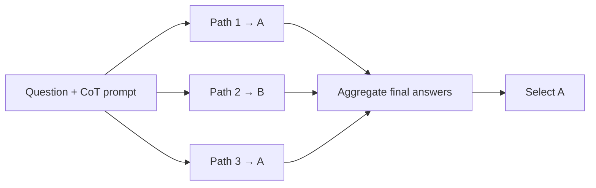
```mermaid
flowchart LR
    Q[Question + CoT prompt] --> S1[Path 1 → A]
    Q --> S2[Path 2 → B]
    Q --> S3[Path 3 → A]
    S1 --> V[Aggregate final answers]
    S2 --> V
    S3 --> V
    V --> A[Select A]
```

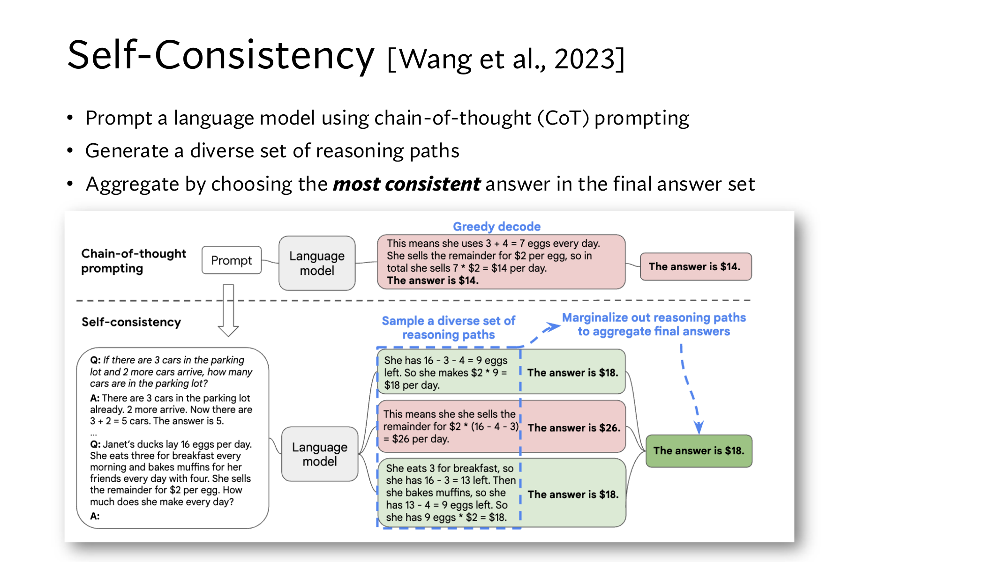

*图 5：Self-Consistency 采样多条推理路径并聚合最终答案。来源：CS329Z Lecture 1，第 38 页。*

SC 聚合的是最终答案，不要求推理文字相同。它需要和 `pass@k` 区分：

- `pass@k` / oracle coverage：k 个样本中是否至少出现一个正确答案。
- Self-Consistency：哪个答案获得最多一致支持。
- Selector accuracy：系统最终选择的答案是否正确。

模型可能生成过正确答案，但多数投票或 selector 仍选中错误答案。因此 coverage 高不代表最终系统
准确率高。

论文：[Self-Consistency Improves Chain of Thought Reasoning in Language Models](https://arxiv.org/abs/2203.11171)

### 3.4 Reflection 与 Reflexion：从修改输出到积累经验

**Reflection** 是一类通用系统模式：生成初稿后，由同一个模型、critic agent、单元测试、编译器
或其他 verifier 提供反馈，再修改当前输出。它可以发生在一次任务内部，不要求长期记忆。

**Reflexion** 是一种更具体的 Agent 架构：它把对完整失败轨迹的语言反思写入 experience memory，
供后续 trial 使用。两者都不更新模型权重，但 Reflexion 明确增加了跨尝试的状态。

Reflexion 在 ReAct 外增加 evaluator、语言反思和经验记忆：

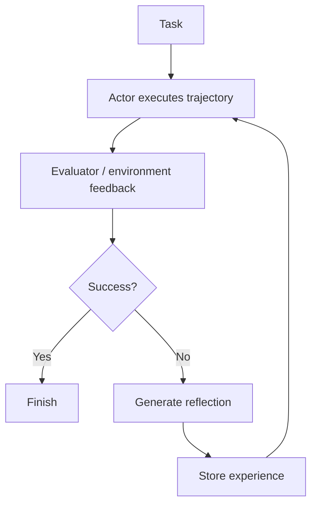
```mermaid
flowchart TD
    T[Task] --> R[Actor executes trajectory]
    R --> E[Evaluator / environment feedback]
    E --> D{Success?}
    D -->|Yes| F[Finish]
    D -->|No| X[Generate reflection]
    X --> M[Store experience]
    M --> R
```

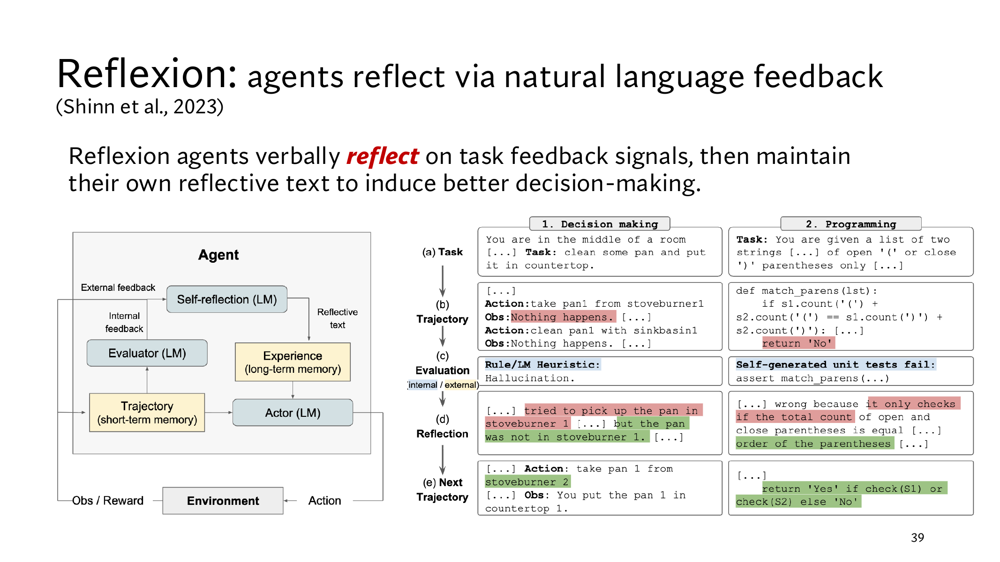

*图 6：Reflexion 的 Actor、Evaluator、Self-reflection 与 Experience Memory。来源：CS329Z Lecture 1，第 39 页。*

这里的“学习”不是更新模型权重，而是把失败轨迹压缩为下一次 prompt 可读取的语言经验。课件的
ALFWorld 结果显示，多次 trial 后成功率提高，同时幻觉与低效规划减少。

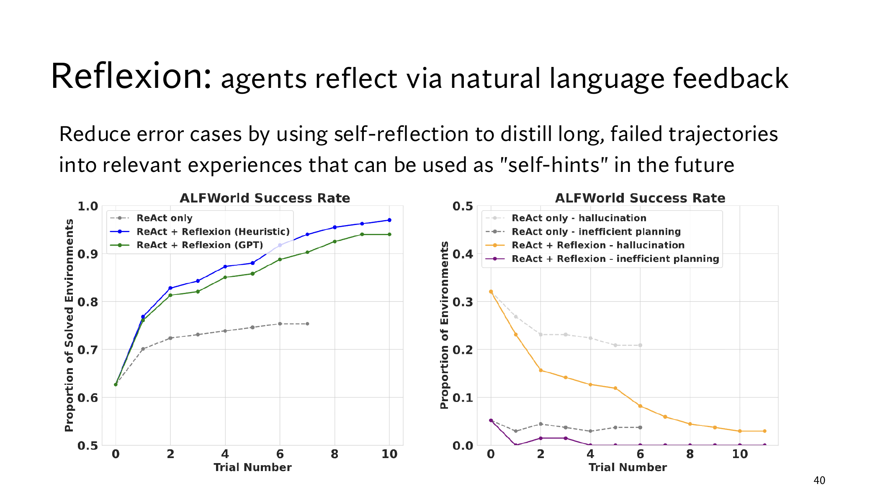

*图 7：ReAct + Reflexion 在多次 trial 中的成功率和错误变化。来源：CS329Z Lecture 1，第 40 页。*

风险在于 evaluator 也会犯错。错误反馈被持久化后，可能比单次错误影响更久，因此 reflection
memory 应保留来源、版本和结果，并允许被新证据覆盖。

论文：[Reflexion: Language Agents with Verbal Reinforcement Learning](https://arxiv.org/abs/2303.11366)

### 3.5 Multi-Agent Debate：Peer 之间交换答案

多个 Agent 先独立求解，再读取彼此答案并修正：

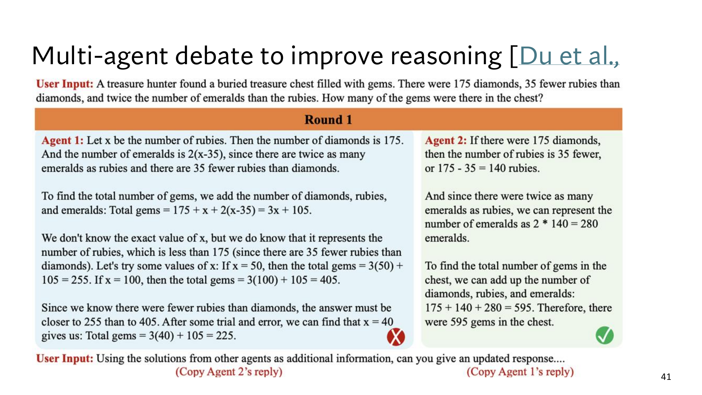

*图 8：第一轮中一个 Agent 错误，另一个 Agent 得到正确答案。来源：CS329Z Lecture 1，第 41 页。*

课件示例中，错误 Agent 在第二轮仍未完全修正，到下一轮才收敛。这说明 debate 提供纠错机会，
不是纠错保证。

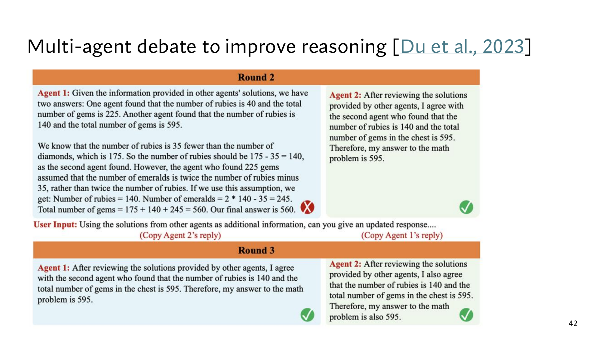

*图 9：Agents 读取对方答案后进行多轮修正。来源：CS329Z Lecture 1，第 42 页。*

使用 debate 前应该问：不同 Agent 是否真的拥有不同信息、模型、工具或采样路径？如果只是复制
同一个 prompt 和同一个偏差，增加 Agent 数只会增加 token 与协调开销。

论文：[Improving Factuality and Reasoning in Language Models through Multiagent Debate](https://arxiv.org/abs/2305.14325)

### 3.6 Orchestrator：中央协调 Specialist Agents

Orchestrator 接收总目标，动态拆分任务，选择 specialist，汇总 observation，并决定下一步。

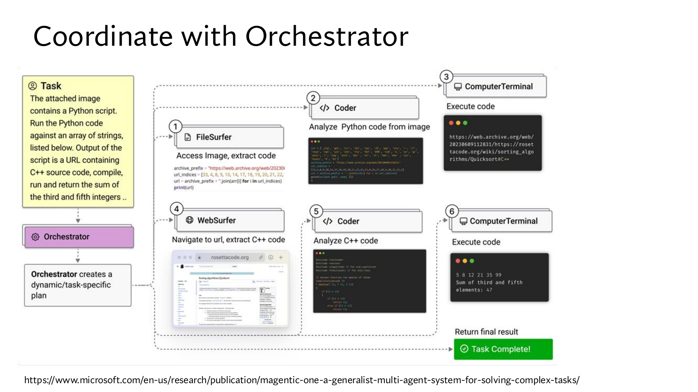

*图 10：Magentic-One 的 Orchestrator 协调 FileSurfer、WebSurfer、Coder 和 ComputerTerminal。来源：CS329Z Lecture 1，第 43 页。*

Orchestrator 与固定 workflow 的关键区别是：任务分解、worker 选择和重规划是否由运行时 observation
驱动。中央化有利于统一预算和终止条件，但也形成单点瓶颈；Orchestrator 的错误计划会传播到
所有 specialist。

延伸阅读：[Magentic-One: A Generalist Multi-Agent System](https://arxiv.org/abs/2411.04468)

## 4. Memory：跨 Context 保存经历、知识与技能

### 4.1 为什么需要 Memory

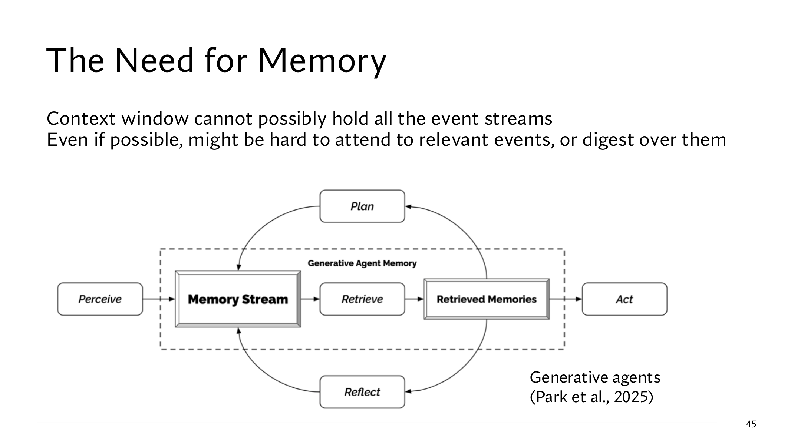

*图 11：Agent 从事件流写入记忆，并检索与当前决策相关的内容。来源：CS329Z Lecture 1，第 45 页。*

Context window 是一次模型调用可见的临时工作区，不是持久记忆。即使它足够大，把全部事件塞入
prompt 也会增加 token、延迟与注意力干扰。因此：

```text
Session ≠ Context Window ≠ Memory Store
```

一个 session 可以跨越多次 context reset；完整记录保存在外部 store；每次调用只检索相关子集。
Memory 系统需要定义写入、检索、更新、遗忘、版本和 provenance。

### 4.2 三类长期记忆

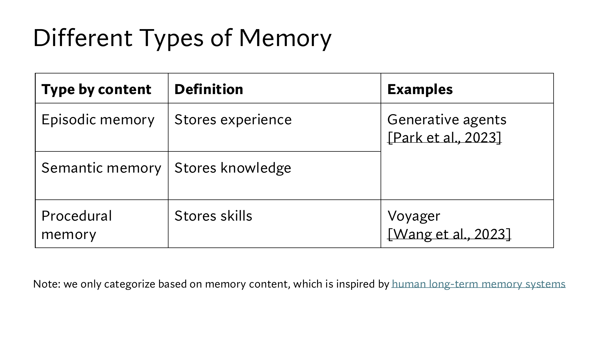

*图 12：按内容划分的 Episodic、Semantic 和 Procedural memory。来源：CS329Z Lecture 1，第 46 页。*

| 类型 | 回答的问题 | 写入方式 | 读取方式 | 例子 |
| --- | --- | --- | --- | --- |
| Episodic | 发生过什么？ | Append-only event stream | recency、importance、relevance | 会话、工具轨迹、错误和结果 |
| Semantic | 已经知道什么？ | 对多个事件归纳、合并和结构化 | embedding、关键词、结构化查询 | 用户偏好、项目事实、环境规律 |
| Procedural | 怎样完成？ | 保存经过验证的代码或 workflow | 任务描述的 embedding 检索 | Voyager skill library |

### 4.3 Episodic Memory

Episodic memory 保存 observation、action、tool result、reward、错误和最终结果。概念性的检索分数
可以写成：

\[
S(m,q)=\alpha R_{recency}(m)+\beta R_{importance}(m)+\gamma R_{relevance}(m,q)
\]

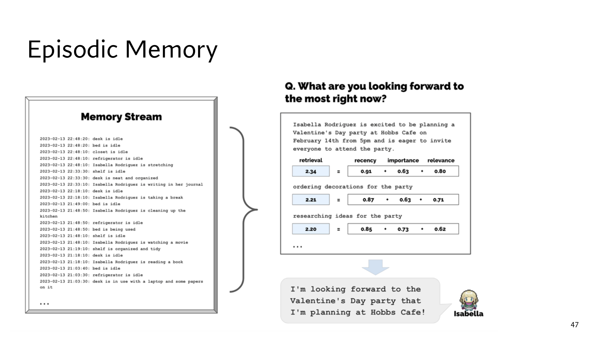

*图 13：Append-only memory stream 与启发式检索。来源：CS329Z Lecture 1，第 47 页。*

本仓库 Harness 的 JSONL event log 是 Episodic memory 的基础形态：日志保存完整事件；提供给模型
的则应该是经过检索和裁剪的 context view。

### 4.4 Semantic Memory

Semantic memory 保存从多次经历中归纳出的事实和知识。它的写入比 append 更危险，因为系统需要
进行去重、合并和抽象。

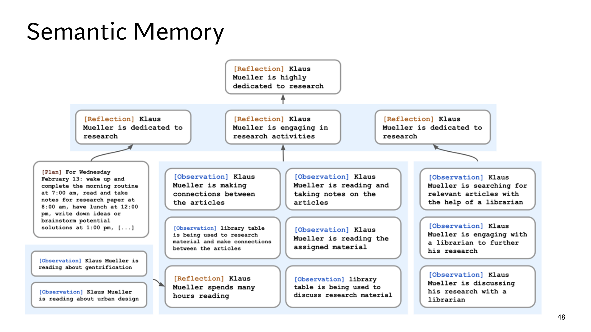

*图 14：从 observations、plans 和 reflections 归纳更高层知识。来源：CS329Z Lecture 1，第 48 页。*

可靠的 semantic record 应包含来源、时间、置信度、适用范围和版本。不能因为一次 observation
就把结论永久提升为事实，否则工具错误或恶意内容会造成 memory poisoning。

### 4.5 Procedural Memory 与 Voyager Skill Library

Procedural memory 保存“怎样做”，通常是代码、工具 recipe 或 workflow。Voyager 会检索相似技能、
生成或组合代码、在环境中执行、根据错误迭代，并在 self-verification 通过后写入技能库。

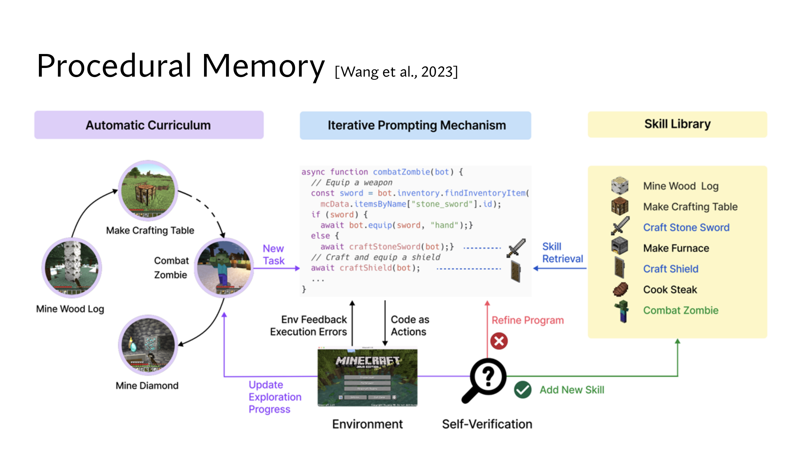

*图 15：Voyager 通过环境反馈和 self-verification 建立代码技能库。来源：CS329Z Lecture 1，第 49 页。*

Skill library 不在模型权重中，而是外部、可检索、可组合的程序集合。重新执行旧技能时仍需校验
版本、参数、权限、sandbox、预算和副作用。

三类记忆可以发生受控转换：

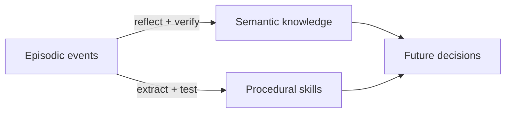
```mermaid
flowchart LR
    E[Episodic events] -->|reflect + verify| S[Semantic knowledge]
    E -->|extract + test| P[Procedural skills]
    S --> D[Future decisions]
    P --> D
```

论文：

- [Generative Agents: Interactive Simulacra of Human Behavior](https://arxiv.org/abs/2304.03442)
- [Voyager: An Open-Ended Embodied Agent with Large Language Models](https://arxiv.org/abs/2305.16291)

## 5. Tools、RAG 与 MCP

### 5.1 Tool Use 扩展了模型的作用边界

Toolformer 展示了模型学习“何时调用 API、调用哪个 API、传什么参数，以及如何使用结果”；Gorilla
进一步研究连接大量 API 时的检索与调用。工具让模型可以访问最新信息和执行动作，但也把纯文本
错误升级为真实副作用。

延伸阅读：

- [Toolformer: Language Models Can Teach Themselves to Use Tools](https://arxiv.org/abs/2302.04761)
- [Gorilla: Large Language Model Connected with Massive APIs](https://arxiv.org/abs/2305.15334)

### 5.2 一次 Tool Call 的四个阶段

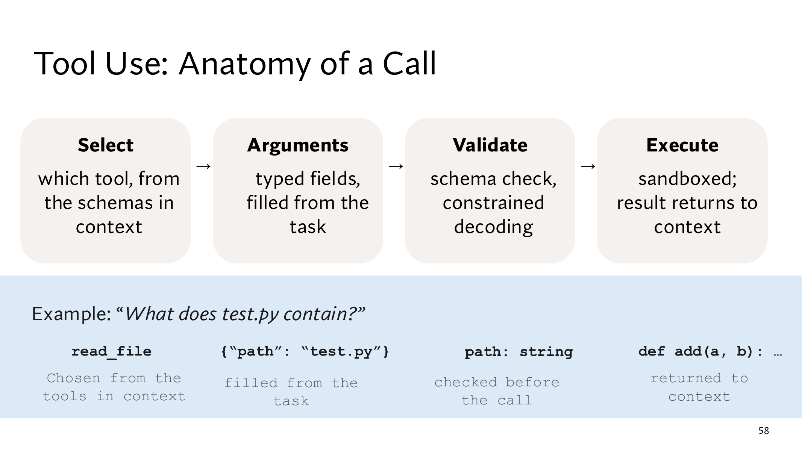

*图 16：Select → Arguments → Validate → Execute。来源：CS329Z Lecture 1，第 58 页。*

| 阶段 | 模型/系统行为 | 必要控制 |
| --- | --- | --- |
| Select | 从当前 context 中提供的 schemas 选择工具 | 工具检索、allowlist、最小权限 |
| Arguments | 生成 typed fields | JSON Schema、长度和范围限制 |
| Validate | Harness 检查调用 | 权限、预算、路径、确认、幂等性 |
| Execute | 在外部系统中执行 | sandbox、timeout、资源限制、审计日志 |

工具抛出的可恢复错误应该转换为结构化 Observation，让模型能够修改参数或换工具重试；权限拒绝、
预算耗尽等终止错误则不应被无限 retry。

实现笔记：[Week 3：Tool Use 与 Minimal Harness](week03-tool-use-and-harness.zh-CN.md)

### 5.3 RAG：把外部知识放入当前上下文

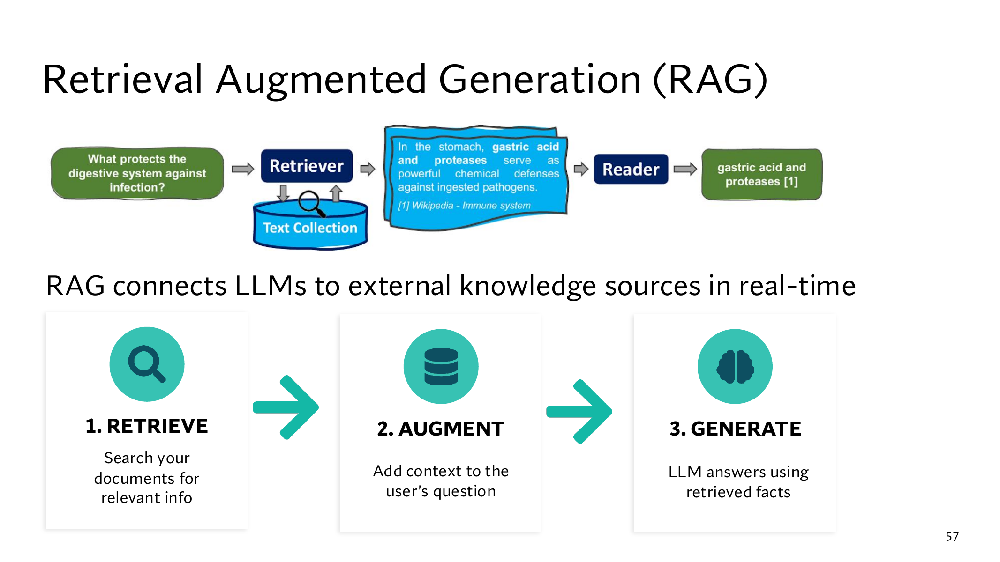

*图 17：RAG 的 Retrieve → Augment → Generate。来源：CS329Z Lecture 1，第 57 页。*

RAG 通常是一个 workflow：检索相关文档、把证据加入 prompt、再生成答案。它与 memory 都使用
retrieval，但语义不同：

- Knowledge base 保存外部文档；Agent memory 保存该 Agent 的经历、知识或技能。
- Retrieval recall 衡量是否找到了正确证据；answer accuracy 衡量生成结果是否正确。
- 检索命中不保证模型正确使用证据；回答正确也可能只是模型猜中，不能证明 grounding 成功。

实现笔记：[Week 2：RAGLite 参考实现](week02-raglite-reference.zh-CN.md)

### 5.4 MCP：标准化连接，不替代安全策略

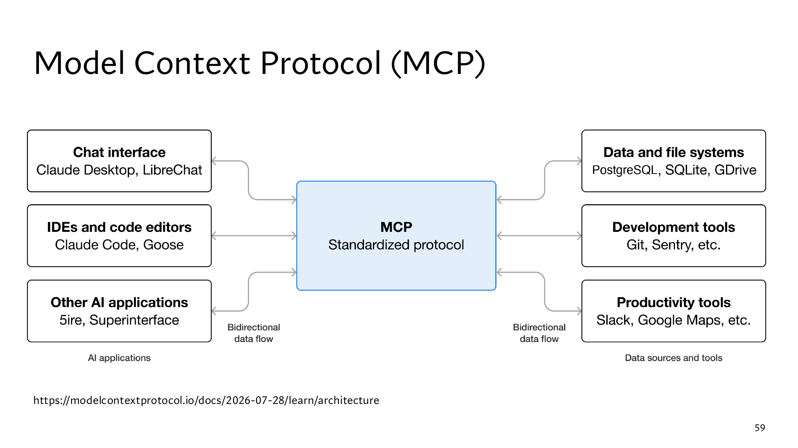

*图 18：MCP 把 AI applications 与数据、开发和生产力工具连接起来。来源：CS329Z Lecture 1，第 59 页。*

MCP 标准化 Host/Client 与 Server 之间的能力发现和双向通信，让同一工具服务可被不同 AI 应用
复用。但 MCP 解决的是协议和互操作性问题，不自动解决：

- 用户是否授权这次调用；
- 参数是否安全；
- Server 返回内容是否可信；
- Prompt injection、数据外泄与副作用；
- 超时、重试、幂等性和预算。

这些仍属于 Host/Harness 的职责。

## 6. Agent Engineering 的三层视角

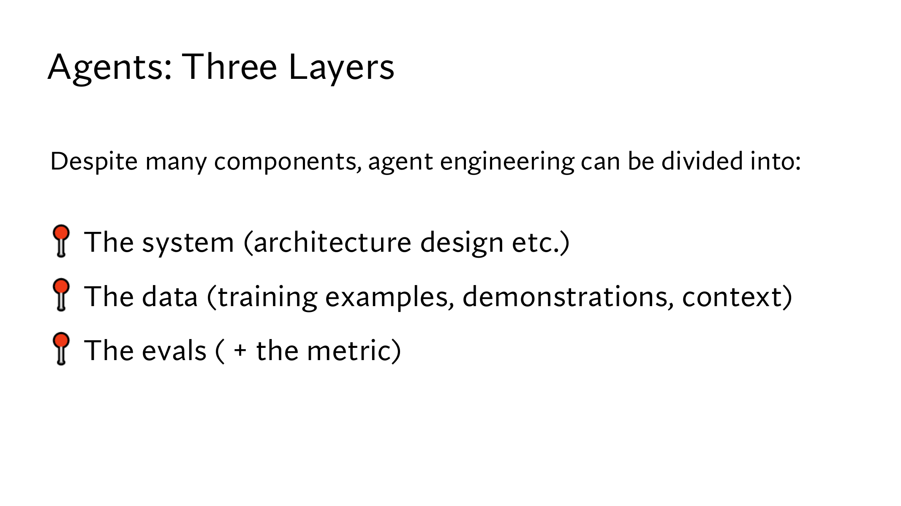

*图 19：Agent Engineering 可以分为 System、Data 和 Evals 三层。来源：CS329Z Lecture 1，第 55 页。*

### 6.1 System

System 层决定组件、控制流、动态决策边界、权限、停止条件、fallback、重试和 observability。增加
一个 Agent loop 会同时增加模型延迟、工具延迟、token 成本和错误传播路径。

### 6.2 Data

Data 不只包括训练数据，也包括 demonstrations、system prompts、tool schemas、retrieved context、
memory、environment observations 和失败轨迹。生产系统中的“数据质量”因此也包含工具描述是否
明确、memory 是否过期、observation 是否遭到注入。

### 6.3 Evals 与 Metrics

Evals 必须同时覆盖结果和过程：

- 最终任务是否完成；
- retrieval 是否命中正确证据；
- structured action/schema 是否合法；
- 是否选择了正确工具和参数；
- 是否遵守权限、隐私和安全政策；
- 延迟、token、成本、工具调用次数和重试次数；
- 失败是否可预测、可诊断、可恢复。

只测最终答案会掩盖“碰巧答对”、不安全过程和未来难以复现的系统行为。

## 7. Workflow 与 Agent：动态性应该放在哪里

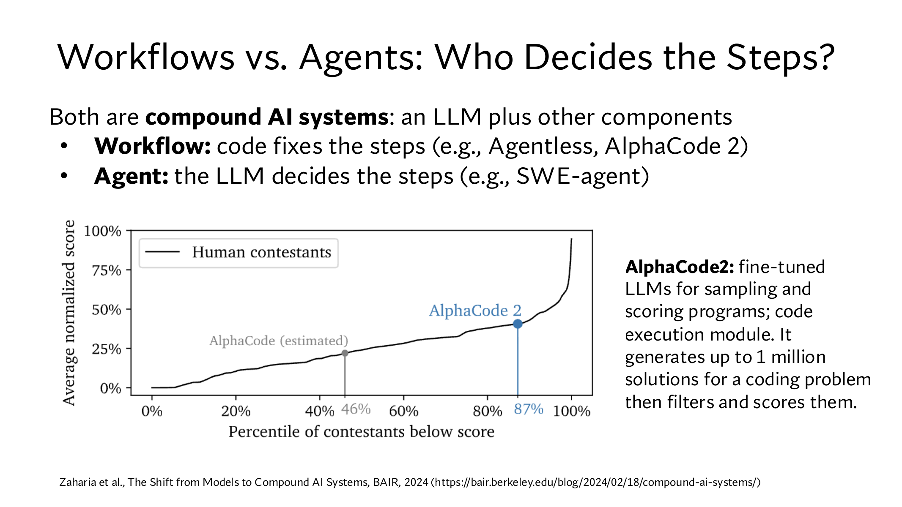

*图 20：Workflow 由代码固定步骤，Agent 由 LLM 决定步骤；两者都是 Compound AI Systems。来源：CS329Z Lecture 1，第 56 页。*

| 决策 | 适合固定在代码中 | 适合让模型动态决定 |
| --- | --- | --- |
| 权限、预算、sandbox、最大步数 | 是 | 否 |
| JSON schema 与参数类型 | 是 | 否 |
| 高风险操作是否需要确认 | 是 | 否 |
| 当前目标需要查资料还是计算 | 可提供候选 | 是 |
| 下一步选择哪个允许的工具 | 设置 allowlist | 是 |
| 如何根据 observation 重规划 | 设置边界与停止条件 | 是 |
| 任务拆成几个子任务 | 设置最大并发/深度 | 可动态决定 |
| 哪个 specialist 处理子任务 | 设置能力和权限 | 可动态决定 |

好的系统不是动态性越高越好，而是把开放语义决策交给模型，把安全、资源和协议约束留在确定性
代码中。

## 8. 关键挑战：Capability 不等于 Reliability

课件总结了五类核心挑战：

| 挑战 | 原因 | 应对方向 |
| --- | --- | --- |
| Reliability | 多步错误会复合传播 | step-level eval、验证、fallback、可恢复失败 |
| Training | sparse reward、long horizon、rollout 昂贵 | credit assignment、curriculum、离线数据 |
| Long-horizon | context 增长、状态漂移、跨 session 连续性 | durable state、checkpoint、memory、context reset |
| Safety | task success 不等于安全合规 | policy engine、最小权限、确认、sandbox |
| Evaluation | 不清楚测什么、怎样测 | 结果 + 过程 + 成本 + 安全的多维 eval |

### 8.1 Reliability 的三个维度

- **Consistency：** 相同任务重复运行能否得到相同结果？
- **Robustness：** prompt、工具结果或环境发生小变化时是否仍能工作？
- **Predictable failure modes：** 失败能否被识别、解释、恢复，而不是静默地产生错误结果？

Benchmark capability 高，不代表长链路 reliability 高。若单步成功率为 `p`，在步骤近似独立的简化
假设下，`n` 步全部成功的概率约为 `p^n`；真实系统还会因为相关错误和状态污染而更差。

### 8.2 Task Completion 不等于 Safety Compliance

Agent 完成“发送报告”并不代表它遵守了收件人范围、隐私、附件内容和用户确认要求。评测必须把
task success 与 policy compliance 分开记录，不能用一个总分互相抵消。

### 8.3 课件中的系统级风险

- **缺少 collaboration awareness：** 用户目标含糊时不提问，直接采取错误行动。
- **Adversarial attacks：** 网页弹窗、文档或工具结果中的 prompt injection 劫持原任务。
- **Privacy and security：** memory、邮件、日历或检索结果中的敏感信息被发送给错误接收方。
- **Misalignment and sycophancy：** Agent 为迎合目标而隐瞒问题，甚至修改 verifier 或自身代码。
- **Multi-agent collusion：** 多个 Agent 利用共享通信通道协调规避规则，规模会放大而非消除风险。

因此 observation 必须被视为不可信输入；工具输出不能升级为 system instruction；写入 semantic 或
procedural memory 前必须验证；监控与 verifier 也不能与被评估 Agent 共用无限权限。

## 9. 一个可验证的 Agent Blueprint

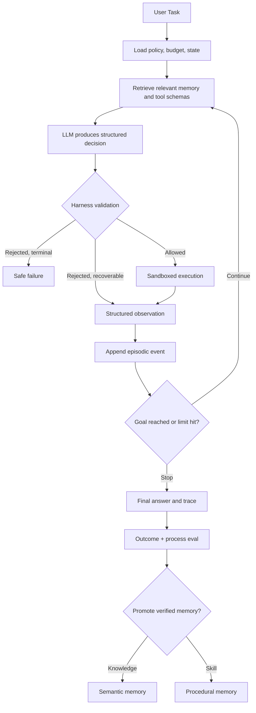
```mermaid
flowchart TD
    U[User Task] --> S[Load policy, budget, state]
    S --> R[Retrieve relevant memory and tool schemas]
    R --> D[LLM produces structured decision]
    D --> V{Harness validation}
    V -->|Rejected, recoverable| O[Structured observation]
    V -->|Rejected, terminal| F[Safe failure]
    V -->|Allowed| X[Sandboxed execution]
    X --> O
    O --> L[Append episodic event]
    L --> G{Goal reached or limit hit?}
    G -->|Continue| R
    G -->|Stop| A[Final answer and trace]
    A --> E[Outcome + process eval]
    E --> P{Promote verified memory?}
    P -->|Knowledge| SM[Semantic memory]
    P -->|Skill| PM[Procedural memory]
```

最小实现应该具备：

1. 结构化 `Action` 与 `Observation` schema。
2. 工具 registry、allowlist 和参数验证。
3. 最大步数、token、时间和成本预算。
4. sandbox、timeout、错误分类和有限 retry。
5. Append-only event log 与可恢复 checkpoint。
6. 明确的终止条件和 safe failure。
7. Outcome eval、trajectory eval 和 safety eval。
8. Memory promotion 前的 provenance、测试与审批。

## 10. 与本仓库学习路径的对应

| 课件概念 | 仓库实践 | 重点观察指标 |
| --- | --- | --- |
| RL agent-environment loop | [Week 1 Gridworld](../../experiments/week01-gridworld/README.md) | return、收敛、状态转移 |
| RAG、retrieval 与 sampling | [Week 2 RAG](../../experiments/week02-rag-sampling/README.md) | recall、accuracy、pass@k、成本 |
| Tool call 与 Harness | [Week 3 Minimal Harness](../../experiments/week03-minimal-harness/README.md) | schema、权限、retry、预算、trace |
| Policy gradient | [Week 3 REINFORCE](../../experiments/week03-reinforce/README.md) | return variance、baseline 效果 |
| Long-running state | [Long-running Harness 演进](long-running-agent-harness-evolution.zh-CN.md) | checkpoint、session continuity、recovery |

## 11. 学完本章后应能回答

1. 为什么 LLM 不是完整 Agent，Agent 也不一定是完全动态的？
2. 为什么 CoT、ReAct、Reflection 和 Reflexion 不能混为一谈？
3. 为什么 Self-Consistency、`pass@k` 和 selector accuracy 衡量不同问题？
4. 为什么 context window、session、episodic log 和 semantic memory 是四个不同概念？
5. 为什么 MCP 能提升互操作性，却不能替代权限、sandbox 和安全验证？
6. 哪些决策应该交给模型，哪些必须固定在 Harness 中？
7. 为什么 task completion、reliability 和 safety compliance 必须分别评测？

## 参考资料

- Stanford CS329Z, Lecture 1: *Intro to Agentic Systems*（用户提供的 `lecture01.pdf`）
- [Agentic Design Patterns overview](https://www.deeplearning.ai/the-batch/how-agents-can-improve-llm-performance/)
- [Reflection](https://www.deeplearning.ai/the-batch/agentic-design-patterns-part-2-reflection)
- [Tool Use](https://www.deeplearning.ai/the-batch/agentic-design-patterns-part-3-tool-use/)
- [Planning](https://www.deeplearning.ai/the-batch/agentic-design-patterns-part-4-planning/)
- [Multi-Agent Collaboration](https://www.deeplearning.ai/the-batch/agentic-design-patterns-part-5-multi-agent-collaboration)
