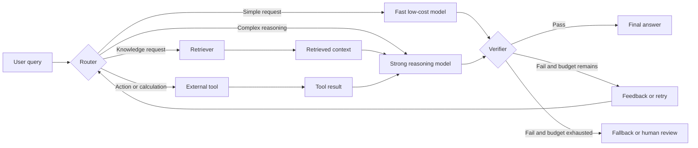

# Week 1 Reading Note: Compound AI Systems

[English](week01-compound-ai-systems.md) | [简体中文](week01-compound-ai-systems.zh-CN.md)

Source: [The Shift from Models to Compound AI Systems](https://bair.berkeley.edu/blog/2024/02/18/compound-ai-systems/)

## 1. AI Model vs. AI System

An **AI model** is a learned statistical function. For example, a Transformer language model
maps an input token sequence to a probability distribution over the next token. Its behavior is
primarily determined by its architecture, weights, input context, and decoding configuration.

A **compound AI system** solves a task through multiple interacting components. These may include
one or more model calls, retrievers, databases, external tools, routers, memory, and verifiers.

The key distinction is the unit being designed:

| AI model | Compound AI system |
| --- | --- |
| A learned component | A complete execution graph |
| Usually one inference interface | May call several models and tools |
| Knowledge is largely encoded in weights and context | Can acquire external or current information |
| Improved mainly through data, training, or model architecture | Improved through both models and system design |
| Evaluated by model-level metrics | Evaluated end to end on quality, cost, latency, and reliability |

A model can therefore be one component inside an AI system; the two terms are not interchangeable.

## 2. Why Better Systems Do Not Always Require Stronger Models

Many leading AI results now come from the coordination of several components, rather than from a
single model call. System-level improvements can be faster, cheaper, or easier to control than
training a new model.

### 2.1 Repeated Sampling and Selection

Calling the same model several times can increase the probability that at least one candidate is
correct. A selector or verifier can then choose among those candidates.

This helps only when two conditions hold:

1. Additional samples increase **coverage**: at least one correct answer is generated.
2. The system has enough **precision** to identify that correct answer.

Without a reliable selection mechanism, more samples may only increase cost and produce more
incorrect candidates. Repeated sampling should therefore be compared against a stronger-model
baseline using quality, latency, and total inference cost.

### 2.2 Dynamic Knowledge

Model weights represent a mostly static snapshot of training. Retrieval and external tools allow a
system to use current, private, or task-specific information without retraining the model.

Examples include:

- Retrieving an updated policy document
- Looking up the current state of a database
- Querying an API for live information
- Reading files from the user's working environment

Retrieval does not automatically guarantee truth: the system must still evaluate source quality,
relevance, and freshness.

### 2.3 Control and Trust

Model generation may vary across runs and may violate formatting or domain constraints. External
components can constrain and inspect model behavior:

- Structured-output schemas restrict output shape.
- Permission layers restrict which tools may be used.
- Code tests and mathematical verifiers check correctness.
- Content filters enforce application policies.
- Human approval gates protect high-impact actions.

These mechanisms improve controllability, but they do not make the full system automatically
deterministic or trustworthy. A flawed verifier can reject correct answers or accept incorrect ones.

### 2.4 Different Performance Objectives

Models differ in quality, speed, context length, and price. A system can route requests according to
task requirements—for example, sending simple requests to a fast model and difficult requests to a
stronger model. The best design depends on the product's objective, not on model quality alone.

## 3. Combining Routing, Retrieval, Tools, Models, and Verification

The components have different responsibilities:

- **Router:** chooses a path according to task type, risk, expected difficulty, and budget.
- **Retriever:** supplies relevant external context.
- **Tool:** executes an action or obtains information that should not be guessed by a model.
- **Model:** interprets the request, reasons over context, and generates a candidate action or answer.
- **Verifier:** checks correctness, policy compliance, format, or task completion.
- **Retry/fallback:** uses verifier feedback, escalates to a stronger path, or requests human review.

The router itself can be implemented with rules, a classifier, an LLM, or a cascade of these
methods. Routing should also be evaluated: an inaccurate router can erase the benefits of every
downstream component.

## 4. Quality, Latency, Cost, and Complexity Trade-offs

| Dimension | What may improve it | Typical cost or risk |
| --- | --- | --- |
| Quality | Retrieval, stronger models, more samples, tools, verification | More calls and more failure surfaces |
| Latency | Parallel calls, caching, early exits, fast routing | Parallelism may increase total cost; caching may become stale |
| Cost | Small-model routing, shorter context, fewer retries | Lower-quality routing or insufficient verification |
| Reliability | Deterministic tools, tests, schemas, human gates | False positives, false negatives, and operational overhead |
| Maintainability | Clear interfaces, tracing, modular components | Additional infrastructure and version management |

There is no universally optimal compound system. A practical design should specify a measurable
service objective, such as:

> Maximize verified task success while keeping p95 latency below 10 seconds and average cost below
> a fixed budget.

That objective makes architectural decisions testable. For example, repeated sampling is useful
only if its measured quality gain justifies its additional latency and cost.

## 5. Main Takeaways

1. A model is a learned component; an AI system is the complete process that delivers a result.
2. Retrieval, tools, routing, and verification can improve a system without retraining its model.
3. Repeated sampling raises the upper bound only when candidate diversity exists, and realizes that
   gain only when selection is reliable.
4. External controls reduce risk but introduce their own errors and operational complexity.
5. Compound AI system design is a multi-objective optimization problem over quality, latency, cost,
   reliability, and maintainability.

