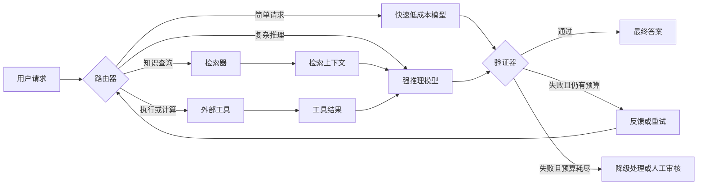

# 第一周阅读笔记：复合 AI 系统

[English](week01-compound-ai-systems.md) | [简体中文](week01-compound-ai-systems.zh-CN.md)

原文：[The Shift from Models to Compound AI Systems](https://bair.berkeley.edu/blog/2024/02/18/compound-ai-systems/)

## 1. AI Model 与 AI System 的区别

**AI 模型**是一个通过数据学习得到的统计函数。例如，Transformer 语言模型将输入 token
序列映射为下一个 token 的概率分布。模型行为主要由模型架构、权重、输入上下文和解码参数决定。

**复合 AI 系统**通过多个相互协作的组件完成 AI 任务。这些组件可以包括一次或多次模型调用、
检索器、数据库、外部工具、路由器、记忆和验证器。

两者的根本区别在于设计对象不同：

| AI 模型 | 复合 AI 系统 |
| --- | --- |
| 一个学习得到的组件 | 一张完整的执行图 |
| 通常提供单一推理接口 | 可以调用多个模型和工具 |
| 知识主要存在于权重和输入上下文中 | 可以获取外部信息和实时信息 |
| 主要通过数据、训练或模型架构改进 | 可以同时通过模型和系统设计改进 |
| 使用模型级指标评测 | 端到端评测质量、成本、延迟和可靠性 |

因此，模型可以是 AI 系统中的一个组件，但 AI 模型和 AI 系统不是同义词。

## 2. 为什么提升系统效果不一定需要训练更强的模型

越来越多的先进 AI 结果来自多个组件的协同，而不是单次调用一个模型。与重新训练模型相比，
系统级改进可能更快、更便宜，也更容易控制。

### 2.1 重复采样与候选选择

对同一个模型进行多次采样，可以提高“至少有一个候选答案正确”的概率。之后，系统可以使用
选择器或 verifier 从候选中选择答案。

这种方法只有在两个条件同时满足时才有效：

1. 增加样本能够提高 **coverage**，即至少生成一个正确答案。
2. 系统具有足够的 **precision**，能够识别并选中这个正确答案。

如果没有可靠的选择机制，增加采样可能只是提高成本，同时产生更多错误候选。因此，应该使用
质量、延迟和总推理成本，将重复采样方案与更强模型的单次调用进行对比。

### 2.2 动态知识

模型权重主要代表训练时的静态知识快照。检索和外部工具使系统能够在不重新训练模型的情况下，
使用最新、私有或特定任务的信息。

例如：

- 检索最新版本的政策文档
- 查询数据库的当前状态
- 通过 API 获取实时信息
- 读取用户工作环境中的文件

检索并不会自动保证真实性：系统仍然需要检查来源质量、相关性和时效性。

### 2.3 控制力与可信度

模型每次生成的结果可能不同，也可能违反格式或领域约束。外部组件能够限制并检查模型行为：

- 结构化输出 schema 限制输出格式。
- 权限层限制模型可以调用的工具。
- 代码测试和数学 verifier 检查正确性。
- 内容过滤器执行应用策略。
- 人工审批保护高影响操作。

这些机制能够提高可控性，但不会自动让整个系统变得确定或完全可信。存在缺陷的 verifier 可能
拒绝正确答案，也可能接受错误答案。

### 2.4 不同的性能目标

不同模型在质量、速度、上下文长度和价格方面各不相同。系统可以根据任务要求进行路由，例如把
简单请求交给快速模型，把困难请求交给更强的推理模型。最优设计取决于产品目标，而不只取决于
模型质量。

## 3. Routing、Retrieval、Tools、Models 与 Verifier 的组合

各组件承担不同责任：

- **Router：** 根据任务类型、风险、预计难度和预算选择执行路径。
- **Retriever：** 提供相关的外部上下文。
- **Tool：** 执行动作，或获取不应该由模型猜测的信息。
- **Model：** 理解请求、结合上下文推理，并生成候选动作或答案。
- **Verifier：** 检查正确性、策略合规性、格式或任务是否完成。
- **Retry/Fallback：** 利用 verifier 反馈重试，转向更强的路径，或请求人工审核。

路由器可以由规则、分类器、LLM 或多种方法的级联实现。Routing 本身也必须接受评测；错误的
路由可能抵消所有下游组件带来的收益。

## 4. 质量、延迟、成本与复杂度之间的权衡

| 维度 | 可能的改进手段 | 常见成本或风险 |
| --- | --- | --- |
| 质量 | 检索、更强模型、更多采样、工具和验证 | 更多调用和更多潜在失败点 |
| 延迟 | 并行调用、缓存、提前退出和快速路由 | 并行可能提高总成本；缓存可能过期 |
| 成本 | 小模型路由、更短上下文、更少重试 | 路由质量下降或验证不足 |
| 可靠性 | 确定性工具、测试、schema 和人工审批 | 假阳性、假阴性和额外运营成本 |
| 可维护性 | 清晰接口、tracing 和模块化组件 | 更多基础设施和版本管理工作 |

不存在对所有场景都最优的复合系统。实际设计应该先确定一个可以测量的服务目标，例如：

> 在 p95 延迟低于 10 秒、平均成本不超过固定预算的条件下，最大化经过验证的任务成功率。

明确的目标能够让架构决策变得可检验。例如，只有当重复采样带来的质量提升足以抵消新增延迟
和成本时，它才是合理选择。

## 5. 核心结论

1. 模型是一个学习得到的组件；AI 系统是交付最终结果的完整过程。
2. Retrieval、tools、routing 和 verification 可以在不重新训练模型的情况下改善系统。
3. 只有在候选具有多样性时，重复采样才能提高上限；只有选择机制可靠时，系统才能兑现该收益。
4. 外部控制组件能够降低风险，但也会引入自己的错误和运营复杂度。
5. 复合 AI 系统设计是一个同时权衡质量、延迟、成本、可靠性和可维护性的多目标优化问题。

