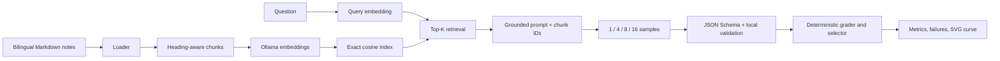

# Week 2: Minimal Bilingual RAG and Repeated Sampling

[English](README.md) | [简体中文](README.zh-CN.md)

## Goal

Build a minimal RAG pipeline without LangChain or another agent/RAG orchestration framework. The
code is an independent, from-scratch reimplementation inspired by the component boundaries of the
open-source [RAGLite](https://github.com/superlinear-ai/raglite) project; it does not import, wrap,
or depend on RAGLite at runtime. This keeps direct control over loading, chunking, embedding, exact
Top-K retrieval, prompting, JSON validation, and evaluation. See the bilingual
[RAGLite comparison note](../../docs/readings/week02-raglite-reference.md) for the component mapping
and the deliberate differences from RAGLite.

The knowledge base is the ten Markdown files in `docs/readings`: five English learning notes and
their five Chinese translations. The learning plan itself is excluded so evaluation questions test
the reading notes rather than the assignment description.

## Data Flow



## Evaluation Set and No-Leakage Boundary

The versioned [questions.json](questions.json) contains the evaluation questions and deterministic
grading rules:

- `question`: the only evaluation-case field sent into the real RAG pipeline.
- `reference_answer`: a human-readable reference included in the result report.
- `answer_groups`: required answer concepts, with alternatives allowed inside each group.
- `evidence_groups`: required concepts for retrieval and citation checks.
- `expected_sources`: note files expected to support the answer.
- `should_abstain`: marks a question whose correct behavior is to refuse to guess.

For the Ollama backend, the reference answer and grading fields are never added to the prompt. The
model receives only the question, retrieved chunks, answer instructions, and JSON Schema. Its actual
responses are recorded in `results.json`. The deterministic fixture intentionally reads the
reference answer to create known pass/fail cases, so fixture outputs are harness tests rather than
model-quality measurements.

## Real Local Run

Install [Ollama](https://ollama.com/download), then pull the bilingual embedding and generation
models:

```bash
ollama pull qwen3-embedding:0.6b
ollama pull qwen3:4b
```

- `qwen3-embedding:0.6b` embeds both the knowledge-base chunks and each query into the same vector
  space for cosine Top-K retrieval.
- `qwen3:4b` receives the grounded prompt and generates the schema-constrained answer with thinking
  disabled by the backend.

The `pull` commands download the models. Make sure the Ollama application is running, or start its
local service with `ollama serve`, before running the experiment.

From the repository root:

```bash
python -m pip install -e ".[dev]"
python experiments/week02-rag-sampling/run.py --backend ollama
```

The run builds a cached index under ignored `data/processed/`, retrieves four chunks per question,
generates 16 samples per question, and writes:

- `results.json`: configuration, retrieval evidence, every sample, and aggregate metrics.
- `pass-at-k.svg`: `pass@k` for `k = 1, 4, 8, 16`.
- `failures.json`: retrieval misses, invalid schemas, and selection failures.

Ollama is local, so monetary cost defaults to zero. For a priced compatible endpoint, pass
`--input-cost-per-million` and `--output-cost-per-million` to populate the same cost metric.

## Reproducible Harness Smoke Test

The repository includes a deterministic fixture backend so CI can verify the whole evaluation path
without downloading a model:

```bash
python experiments/week02-rag-sampling/run.py --backend fixture
```

Its committed `fixture-*.json/svg` files are **harness fixtures, not model-quality results**. The
fixture deliberately emits a repeating sequence containing a correct low-confidence answer, a
wrong high-confidence answer, invalid JSON, and another correct answer.

- [Fixture metrics and samples](fixture-results.json)
- [Fixture failure records](fixture-failures.json)
- [Fixture pass@k curve](fixture-pass-at-k.svg)


## Metrics

The evaluator generates 16 samples once, then evaluates `k = 1, 4, 8, 16`:

- `sample_success_rate`: fraction of samples that are correct, schema-valid, and evidence-backed.
- `pass_at_k`: standard unbiased estimator `1 - C(n-c, k) / C(n, k)` from all 16 samples.
- `coverage_at_k`: observed fraction of questions whose first `k` samples contain a passing answer.
- `selection_precision`: correctness of schema-valid answers selected by maximum model confidence.
- `system_accuracy`: correct selected answers divided by all questions.
- `schema_valid_rate`: fraction passing strict local schema and citation validation.
- `retrieval_hit_rate`: answerable questions whose Top-K contains the required source and evidence.
- `output_diversity`: mean pairwise Jaccard distance over word and Chinese-bigram features.
- token counts, client/provider latency, and cost.

Coverage and final accuracy are intentionally separate. More sampling can produce a correct answer
while a weak selector still chooses a confident wrong answer.

## Retrieval, Generation, and Selection Boundaries

The experiment keeps three failure stages separate:

| Stage | Behavior | Score or decision |
|---|---|---|
| Retrieval | Runs once per question and selects evidence chunks | Cosine similarity `score` ranks chunks into retrieval Top-K |
| Generation | Reuses the same retrieved evidence to produce 16 candidates | Each answer contains model self-reported `confidence` |
| Selection | For each evaluation `k`, inspects the first `k` samples | Selects exactly one schema-valid answer with maximum `confidence`, or none if all are invalid |

Retrieval `score` and answer `confidence` are unrelated. A high retrieval score means that a chunk
is close to the query in embedding space; answer confidence is an uncalibrated value written by the
generation model. The selector does not currently use retrieval scores, majority voting, or an
independent verifier.

This separation makes failures attributable:

- `retrieval_hit = false`: the expected source and evidence were not both present in Top-K, so this
  is a retrieval failure.
- `retrieval_hit = true`, but no sample passes: evidence was available, but generation failed.
- A passing sample exists, but the selected answer fails: generation had coverage, but selection
  failed.

`pass@k` measures the chance that a candidate pool of size `k` contains at least one passing answer;
it does not say whether the selector chose that answer. `selection_precision` divides correct
selected answers by questions for which a valid answer was selected, while `system_accuracy`
divides correct selected answers by all questions.

## Seeds and Reproducibility

The seed controls generation sampling, not the current deterministic embedding and exact cosine
retrieval stages. Evaluation case number `i` receives base seed `seed + i * 1000`; its generated
samples then use consecutive seeds starting at that base. The fixture backend is scripted by call
order and ignores the seed value, while Ollama receives each seed in its generation options.

Reproducing a real-model experiment also requires the same corpus, code revision, questions,
chunking configuration, retrieval Top-K, temperature, model versions, and Ollama/runtime version.
Timestamps and latency are environmental measurements and are not expected to match exactly.

## Structured Answer

Every non-abstaining response must cite at least one retrieved chunk ID:

```json
{
  "answer": "Grounded answer in the question's language.",
  "citations": ["retrieved-chunk-id"],
  "abstained": false,
  "confidence": 0.72
}
```

The dynamic JSON Schema restricts citations to the current Top-K IDs. The local validator then
rejects malformed JSON, extra or missing fields, invented citations, duplicate citations, invalid
confidence, and non-abstaining answers with no citation.

## Controlled Failure Cases

The committed fixture run records three useful failures:

1. Feature hashing misses the exact Initializer Agent evidence at Top-4, demonstrating a retrieval
   failure that a multilingual semantic embedder should improve.
2. Deliberately malformed samples are rejected as invalid JSON rather than silently parsed.
3. At `k >= 4`, correct candidates exist, but maximum self-reported confidence selects the wrong
   candidate. Coverage remains high while final system accuracy drops.

These cases are the next comparison points for a real Ollama run and for future reranking or verifier
work.
