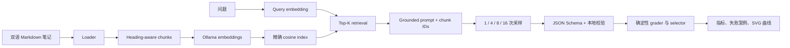
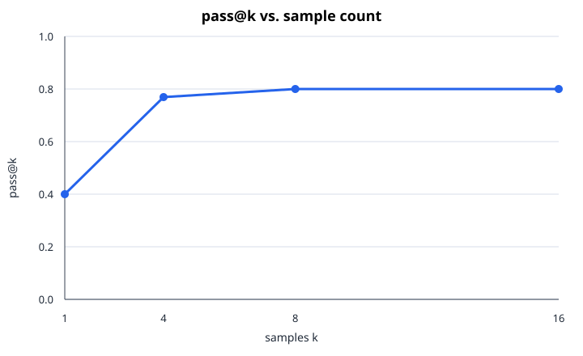

# 第二周：最小双语 RAG 与重复采样

[English](README.md) | [简体中文](README.zh-CN.md)

## 目标

不使用 LangChain 或其他 Agent/RAG orchestration framework，从零构建一个最小 RAG pipeline。
本项目参考开源 [RAGLite](https://github.com/superlinear-ai/raglite) 的组件边界，从零独立重新实现；
代码不会在运行时导入、封装或依赖 RAGLite。这样可以直接控制文档加载、chunking、embedding、
精确 Top-K retrieval、prompt、JSON 校验和 evaluation。组件对应关系以及与 RAGLite 有意保留的
差异见双语 [RAGLite 对照笔记](../../docs/readings/week02-raglite-reference.zh-CN.md)。

知识库是 `docs/readings` 中的十个 Markdown 文件：五篇英文学习笔记和对应的五篇中文翻译。
学习计划本身不进入知识库，避免评测问题只检索到任务说明。

## 数据流



## 评测问题与防泄漏边界

版本化的 [questions.json](questions.json) 保存评测问题和确定性评分规则：

- `question`：真实 RAG pipeline 唯一接收的 evaluation case 字段。
- `reference_answer`：供人阅读、随结果报告保存的参考答案。
- `answer_groups`：正确答案必须覆盖的概念；同一组内可以提供多个候选表达。
- `evidence_groups`：retrieval 与 citation 检查必须命中的证据概念。
- `expected_sources`：预期能够支持答案的笔记文件。
- `should_abstain`：标记正确行为应当是拒绝猜测的问题。

使用 Ollama backend 时，参考答案和评分字段不会加入 prompt。模型只能看到问题、检索到的 chunks、
回答指令和 JSON Schema；实际模型回答写入 `results.json`。确定性 fixture 为了构造已知的成功和失败
样本，会有意读取参考答案，因此 fixture 输出只能验证 harness，不能作为模型质量结果。

## 本地真实模型实验

安装 [Ollama](https://ollama.com/download)，然后下载双语 embedding 与生成模型：

```bash
ollama pull qwen3-embedding:0.6b
ollama pull qwen3:4b
```

- `qwen3-embedding:0.6b` 把知识库 chunks 和每次 query 映射到同一个向量空间，用于 cosine
  Top-K retrieval。
- `qwen3:4b` 接收 grounded prompt；backend 会关闭 thinking，生成受 schema 约束的答案。

`pull` 命令只负责下载模型。运行实验前请确保 Ollama 应用已经启动；如果没有后台服务，可以执行
`ollama serve` 启动本地服务。

在仓库根目录执行：

```bash
python -m pip install -e ".[dev]"
python experiments/week02-rag-sampling/run.py --backend ollama
```

脚本会在已忽略的 `data/processed/` 下缓存索引；每个问题检索四个 chunk，再生成 16 个样本，
最后写出：

- `results.json`：配置、检索证据、每个样本与聚合指标。
- `pass-at-k.svg`：`k = 1、4、8、16` 的 `pass@k` 曲线。
- `failures.json`：检索漏召回、schema 不合法和选择失败。

Ollama 在本地运行，所以默认货币成本为零。如果改接有价格的兼容 endpoint，可以传入
`--input-cost-per-million` 与 `--output-cost-per-million`，继续使用同一套成本指标。

## 可复现的 Harness Smoke Test

仓库提供了一个确定性的 fixture backend，让 CI 不下载模型也能验证完整评测路径：

```bash
python experiments/week02-rag-sampling/run.py --backend fixture
```

提交到仓库的 `fixture-*.json/svg` 是 **harness fixture，不是模型质量结果**。Fixture 会故意循环
生成：低置信度正确答案、高置信度错误答案、非法 JSON、另一个正确答案。

- [Fixture 指标与样本](fixture-results.json)
- [Fixture 失败记录](fixture-failures.json)
- [Fixture pass@k 曲线](fixture-pass-at-k.svg)



## 指标定义

Evaluator 一次生成 16 个样本，再分别计算 `k = 1、4、8、16`：

- `sample_success_rate`：正确、schema 合法且有证据支持的样本比例。
- `pass_at_k`：用全部 16 个样本计算标准无偏估计 `1 - C(n-c, k) / C(n, k)`。
- `coverage_at_k`：前 `k` 个样本中至少包含一个通过答案的问题比例。
- `selection_precision`：在 schema 合法答案中，按模型置信度选出的答案有多准确。
- `system_accuracy`：最终选对的问题数除以全部问题数。
- `schema_valid_rate`：通过本地 schema 与 citation 严格校验的比例。
- `retrieval_hit_rate`：Top-K 同时命中预期来源与关键证据的可回答问题比例。
- `output_diversity`：用英文词和中文 bigram 计算的平均两两 Jaccard distance。
- token 数、客户端/provider 延迟与成本。

Coverage 与最终正确率必须分开。增加采样可能已经生成正确答案，但较弱的 selector 仍会选择一个
高置信度错误答案。

## Retrieval、Generation 与 Selection 的边界

实验把三个失败阶段分开记录：

| 阶段 | 行为 | 分数或决策 |
|---|---|---|
| Retrieval | 每个问题执行一次，选择证据 chunks | Cosine similarity `score` 对 chunks 排序并产生 retrieval Top-K |
| Generation | 重用同一批检索证据，生成 16 个候选答案 | 每个答案包含模型自报的 `confidence` |
| Selection | 对每个评测 `k` 查看前 `k` 个样本 | 在 schema 合法答案中按最高 `confidence` 选且只选一个；全部不合法则不选 |

Retrieval `score` 与答案 `confidence` 没有直接关系。高 retrieval score 只表示 chunk 在 embedding
空间中接近 query；answer confidence 是生成模型写入 JSON 的、未经校准的自我评分。当前 selector
不会使用 retrieval score、majority voting 或独立 verifier。

因此可以定位失败阶段：

- `retrieval_hit = false`：Top-K 没有同时包含预期来源和关键证据，属于 retrieval failure。
- `retrieval_hit = true`，但没有任何样本通过：证据已经存在，但 generation failure。
- 已经存在通过样本，最终答案却错误：generation 已有 coverage，但 selection failure。

`pass@k` 衡量大小为 `k` 的候选池中至少出现一个通过答案的概率，并不表示 selector 选中了它。
`selection_precision` 的分母是成功选出合法答案的问题数；`system_accuracy` 的分母是全部问题数。

## Seed 与可复现性

Seed 控制 generation sampling，不参与当前确定性的 embedding 与精确 cosine retrieval。第 `i` 个
evaluation case 使用基础 seed `seed + i * 1000`，该问题的多个生成样本再从这个值开始使用连续
seed。Fixture backend 按调用顺序输出固定脚本并忽略 seed；Ollama 则在每次生成的 options 中接收
对应 seed。

复现真实模型实验还需要保持语料、代码版本、问题集、chunk 配置、retrieval Top-K、temperature、
模型版本以及 Ollama/runtime 版本一致。时间戳和延迟受运行环境影响，不要求完全相同。

## Structured Answer

每个不拒答的结果至少要引用一个本次检索得到的 chunk ID：

```json
{
  "answer": "使用问题语言给出的、有证据支持的答案。",
  "citations": ["retrieved-chunk-id"],
  "abstained": false,
  "confidence": 0.72
}
```

动态 JSON Schema 把 citation 限定为当前 Top-K 的 ID。本地 validator 还会拒绝非法 JSON、字段
缺失或多余、虚构 citation、重复 citation、越界 confidence，以及没有 citation 却不拒答的结果。

## 受控失败案例

已提交的 fixture 结果稳定记录了三类失败：

1. Feature hashing 在 Top-4 没找到 Initializer Agent 的准确证据。这是一个检索漏召回案例，后续
   应由多语言 semantic embedder 改进。
2. 故意生成的非法 JSON 被 validator 拒绝，没有被静默解析。
3. 当 `k >= 4` 时，候选中已经存在正确答案，但按模型自报置信度选择时挑中了错误答案；coverage
   仍然较高，最终 system accuracy 却下降。

真实 Ollama 运行以及后续 reranking/verifier 实验都应与这些失败案例对照。
